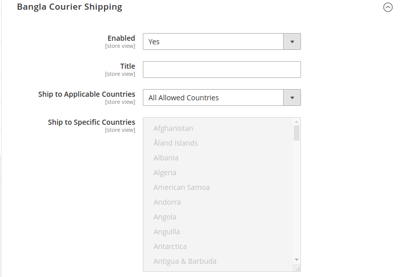
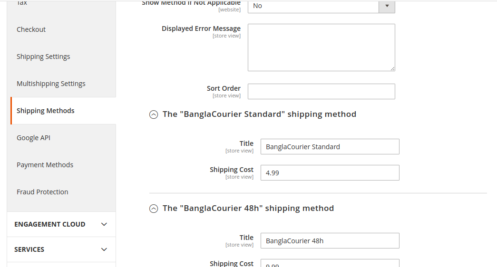
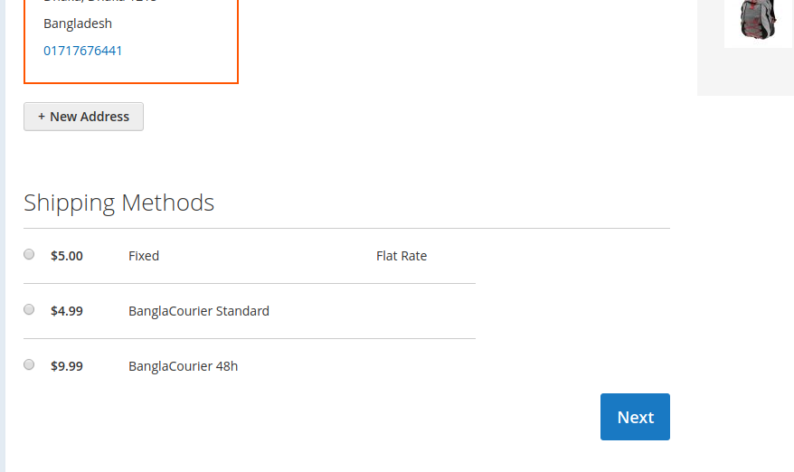

#  Create New BanglaCourier Programmatically In Magento 2


## Goal
- Create New BanglaCourier Using Setup db script.







## Step By Step Tutorials

- [app/code/Bdcrops/BanglaCourier/registration.php](registration.php)

    <details><summary>Source</summary>

      ```
      <?php
          \Magento\Framework\Component\ComponentRegistrar::register(
              \Magento\Framework\Component\ComponentRegistrar::MODULE,
              'Bdcrops_BanglaCourier',
              __DIR__
          );
      ```
    </details>


- Create [app/code/Bdcrops/BanglaCourier/etc/module.xml](etc/module.xml)

  <details><summary>Source</summary>

      ```
      <?xml version="1.0"?>
      <config xmlns:xsi="http://www.w3.org/2001/XMLSchema-instance" xsi:noNamespaceSchemaLocation="urn:magento:framework:Module/etc/module.xsd">
      <module name="Bdcrops_BanglaCourier" setup_version="1.0.0"/>
      </config>

      ```
  </details>

  - [Model/Carrier/BanglaCourier.php](Model/Carrier/BanglaCourier.php)
  - [etc/adminhtml/system.xml](etc/adminhtml/system.xml)
  - [etc/config.xml](etc/config.xml)


## Ref
- [mageplaza](https://www.mageplaza.com/devdocs/magento-2-create-shipping-method/)
