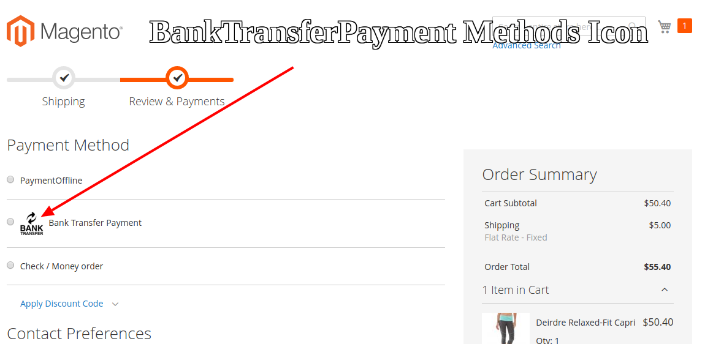

#  Create New BanktransferIcon Programmatically In Magento 2


## Goal
- Show  Banktransfer Icon Payment Methods list frontend/Customer  Checkout.




## Step By Step Tutorials

- [app/code/Bdcrops/BanktransferIcon/registration.php](registration.php)

    <details><summary>Source</summary>

      ```
      <?php
          \Magento\Framework\Component\ComponentRegistrar::register(
              \Magento\Framework\Component\ComponentRegistrar::MODULE,
              'Bdcrops_BanktransferIcon',
              __DIR__
          );
      ```
    </details>


- Create [app/code/Bdcrops/BanktransferIcon/etc/module.xml](etc/module.xml)

  <details><summary>Source</summary>

      ```
      <?xml version="1.0"?>
      <config xmlns:xsi="http://www.w3.org/2001/XMLSchema-instance" xsi:noNamespaceSchemaLocation="urn:magento:framework:Module/etc/module.xsd">
      <module name="Bdcrops_BanktransferIcon" setup_version="1.0.0"/>
      </config>

      ```
  </details>

- Create  [app/code/Bdcrops/BanktransferIcon/etc/frontend/di.xml](etc/frontend/di.xml)

  <details><summary>Source</summary>

      ```
      <?xml version="1.0"?>
      <config xmlns:xsi="http://www.w3.org/2001/XMLSchema-instance"
              xsi:noNamespaceSchemaLocation="urn:magento:framework:ObjectManager/etc/config.xsd">
          <type name="Magento\Checkout\Model\CompositeConfigProvider">
              <arguments>
                  <argument name="configProviders" xsi:type="array">
                      <item name="add_logo_in_bank_transfer_payment_config_provider" xsi:type="object">Bdcrops\BanktransferIcon\Model\BanktransferConfigProvider</item>
                  </argument>
              </arguments>
          </type>
      </config>
      ```
  </details>
- Create  [Model/BanktransferConfigProvider.php](Model/BanktransferConfigProvider.php)

  <details><summary>Source</summary>

      ```
      <?php
      declare(strict_types=1);

      namespace Bdcrops\BanktransferIcon\Model;

      use Magento\Checkout\Model\ConfigProviderInterface;
      use Magento\Framework\View\Asset\Repository;

      class BanktransferConfigProvider implements ConfigProviderInterface
      {
          /**
           * @var Repository
           */
          private $assetRepository;

          /**
           * BanktransferConfigProvider constructor.
           *
           * @param Repository $assetRepository
           */
          public function __construct(
              Repository $assetRepository
          ) {
              $this->assetRepository = $assetRepository;
          }

          /**
           * {@inheritdoc}
           */
          public function getConfig()
          {
              $banktransferLogoUrl = $this->assetRepository->getUrlWithParams('Bdcrops_BanktransferIcon::images/banktransfer.png', []);
              return [
                  'payment' => [
                      'banktransfer' => [
                          'banktransferLogoUrl' => $banktransferLogoUrl
                      ]
                  ]
              ];
          }
      }

      ```
  </details>
- Create [view/frontend/requirejs-config.js](view/frontend/requirejs-config.js)

  <details><summary>Source</summary>

      ```
       var config = {
          config: {
              mixins: {
                  'Magento_OfflinePayments/js/view/payment/method-renderer/banktransfer-method': {
                      'Bdcrops_BanktransferIcon/js/mixin/banktransfer-method-mixin': true
                  }
              }
          }
      };

      ```
  </details>
- Create  [view/frontend/web/js/mixin/banktransfer-method-mixin.js](view/frontend/web/js/mixin/banktransfer-method-mixin.js)

  <details><summary>Source</summary>

      ```
      define([
          'jquery',
          'ko'
      ], function ($, ko) {
          'use strict';

          return function (banktransferMethod) {
              return banktransferMethod.extend({
                  defaults: {
                      template: 'Bdcrops_BanktransferIcon/payment/banktransfer'
                  },
                  getLogoUrl: function () {
                      return window.checkoutConfig.payment.banktransfer.banktransferLogoUrl;
                  }
              });
          };
      });

      ```
  </details>

- Create  [view/frontend/web/template/payment/banktransfer.html](view/frontend/web/template/payment/banktransfer.html)

  <details><summary>Source</summary>

      ```

      <div class="payment-method" data-bind="css: {'_active': (getCode() == isChecked())}">
          <div class="payment-method-title field choice">
              
              <input type="radio"
                     name="payment[method]"
                     class="radio"
                     data-bind="attr: {'id': getCode()}, value: getCode(), checked: isChecked, click: selectPaymentMethod, visible: isRadioButtonVisible()" />
              <label data-bind="attr: {'for': getCode()}" class="label"><span data-bind="text: getTitle()"></span></label>
          </div>

          <div class="payment-method-content">
              <!-- ko foreach: getRegion('messages') -->
              <!-- ko template: getTemplate() --><!-- /ko -->
              <!--/ko-->
              <div class="payment-method-billing-address">
                  <!-- ko foreach: $parent.getRegion(getBillingAddressFormName()) -->
                  <!-- ko template: getTemplate() --><!-- /ko -->
                  <!--/ko-->
              </div>
              <p data-bind="html: getInstructions()"></p>
              <div class="checkout-agreements-block">
                  <!-- ko foreach: $parent.getRegion('before-place-order') -->
                      <!-- ko template: getTemplate() --><!-- /ko -->
                  <!--/ko-->
              </div>
              <div class="actions-toolbar">
                  <div class="primary">
                      <button class="action primary checkout"
                              type="submit"
                              data-bind="
                              click: placeOrder,
                              attr: {'title': $t('Place Order')},
                              enable: (getCode() == isChecked()),
                              css: {disabled: !isPlaceOrderActionAllowed()}
                              "
                              disabled>
                          <span data-bind="i18n: 'Place Order'"></span>
                      </button>
                  </div>
              </div>
          </div>
      </div>

      ```
  </details>

## Ref
- [](https://magento.stackexchange.com/questions/297904/how-can-add-credit-card-visa-etc-icon-checkout-magento-2/298028#298028)
