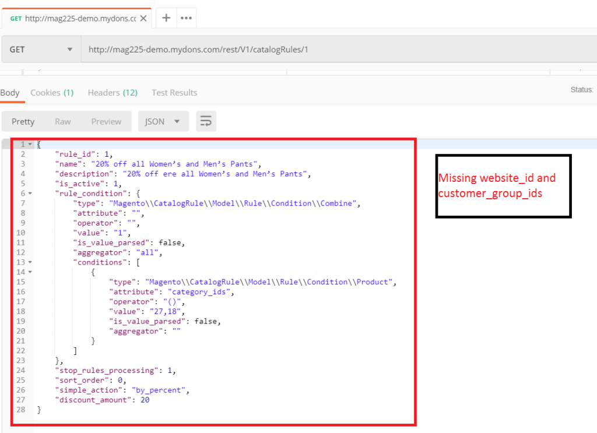

#  Create Catalog Price Rule in REST API In Magento 2
Magento 2 Catalog Price Rule is not exposed as a REST API End Point. Catalog Price Rule API feature is an important feature for those who work in Creating Mobile App and Third Party Integration. Though this feature is not available we can extend magento core with our custom code to expose this API End Point. Lets see how to achieve this with our custom code.

## Goal
- Create Catalog Price Rule in REST API
http://www.magento233.lan/rest/V1/catalogRules/1


## Step By Step Tutorials

- [app/code/Bdcrops/CatalogRuleApi/registration.php](registration.php)

    <details><summary>Source</summary>

    ```
    <?php
        \Magento\Framework\Component\ComponentRegistrar::register(
            \Magento\Framework\Component\ComponentRegistrar::MODULE,
            'Bdcrops_CatalogRuleApi',
            __DIR__
        );
    ```
    </details>


- [app/code/Bdcrops/CatalogRuleApi/etc/module.xml](etc/module.xml)

    <details><summary>Source</summary>

    ```
    <?xml version="1.0"?>
    <config xmlns:xsi="http://www.w3.org/2001/XMLSchema-instance" xsi:noNamespaceSchemaLocation="urn:magento:framework:Module/etc/module.xsd">
        <module name="Bdcrops_CatalogRuleApi" setup_version="1.0.0"/>
    </config>

    ```
    </details>


- [app/code/Bdcrops/CatalogRuleApi/etc/webapi.xml](etc/webapi.xml)


    <details><summary>Source</summary>

      ```
      <?xml version="1.0"?>
      <routes xmlns:xsi="http://www.w3.org/2001/XMLSchema-instance"
              xsi:noNamespaceSchemaLocation="urn:magento:module:Magento_Webapi:etc/webapi.xsd">
          <route url="/V1/catalogRules/:ruleId" method="GET">
              <service class="Magento\CatalogRule\Api\CatalogRuleRepositoryInterface" method="get"/>
              <resources>
                  <resource ref="anonymous" />
              </resources>
          </route>
      	<route url="/V1/catalogRules/search" method="GET">
              <service class="Bdcrops\CatalogRuleApi\Api\CatalogRuleRepositoryInterface" method="getList"/>
              <resources>
                  <resource ref="anonymous" />
              </resources>
          </route>
          <route url="/V1/catalogRules/:ruleId" method="DELETE">
              <service class="Magento\CatalogRule\Api\CatalogRuleRepositoryInterface" method="deleteById"/>
              <resources>
                  <resource ref="anonymous" />
              </resources>
          </route>
          <route url="/V1/catalogRules/:ruleId" method="PUT">
              <service class="Magento\CatalogRule\Api\CatalogRuleRepositoryInterface" method="save"/>
              <resources>
                  <resource ref="anonymous" />
              </resources>
          </route>
          <route url="/V1/catalogRules" method="POST">
              <service class="Magento\CatalogRule\Api\CatalogRuleRepositoryInterface" method="save"/>
              <resources>
                  <resource ref="anonymous" />
              </resources>
          </route>
      </routes>
      ```
      </details>


    we need to create an webapi.xml file to define the REST API End Points.

    The Core Magento 2 CatalogRule module already contains the necessary code for carrying out the API Operation in the below files, only drawback is those methods were not exposed as webapi end points. Lets define the REST API route path as “catalogRules”.

    Though the main methods are all available in magento core, the “getList” method is not available by default and we will implement it separately. For this demo i am skipping the ACL Part and defining the “resource ref” as anonymous

    Magento 2 Core Files Reference:-
    Magento\CatalogRule\Api\interface\CatalogRuleRepositoryInterface

    Magento\CatalogRule\Model\Rule.php

- [app/code/Bdcrops/CatalogRuleApi/Api/CatalogRuleRepositoryInterface.php](Api/CatalogRuleRepositoryInterface.php)

    <details><summary>Source</summary>

    ```
    <?php
    namespace Bdcrops\CatalogRuleApi\Api;

    use \Magento\Framework\Api\SearchCriteriaInterface;

    interface CatalogRuleRepositoryInterface {
        /**
         * Get rules
         * @param \Magento\Framework\Api\SearchCriteriaInterface $searchCriteria
         * @return \Magento\Framework\Api\SearchResultsInterface
         */
         public function getList(
           \Magento\Framework\Api\SearchCriteriaInterface $searchCriteria);

    }

    ```
    </details>


- [app/code/Bdcrops/CatalogRuleApi/etc/di.xml](etc/di.xml)

    <details><summary>Source</summary>

    ```
    <?xml version="1.0"?>
    <config xmlns:xsi="http://www.w3.org/2001/XMLSchema-instance" xsi:noNamespaceSchemaLocation="urn:magento:framework:ObjectManager/etc/config.xsd">
        <preference for="Bdcrops\CatalogRuleApi\Api\CatalogRuleRepositoryInterface"
    	            type="Bdcrops\CatalogRuleApi\Model\CatalogRuleManagement" />
        <preference for="Magento\CatalogRule\Api\CatalogRuleRepositoryInterface"
                	type="Magento\CatalogRule\Model\CatalogRuleRepository" />

    </config>
    ```
    </details>


- Result

At this point now we can execute the below REST API methods V1/catalogRules/:ruleId GET, DELETE, POST, PUT. But the problem here is the GET Method returns data without website_ids and customer_group_ids as show in the below screenshot.



- [app/code/Bdcrops/CatalogRuleApi/etc/extension_attributes.xml](etc/extension_attributes.xml)

  <details><summary>Source</summary>

  ```
  <?xml version="1.0"?>
  <config xmlns:xsi="http://www.w3.org/2001/XMLSchema-instance" xsi:noNamespaceSchemaLocation="urn:magento:framework:Api/etc/extension_attributes.xsd">
      <extension_attributes for="Magento\CatalogRule\Api\Data\RuleInterface">
          <attribute code="website_ids" type="int[]"/>
          <attribute code="customer_group_ids" type="int[]"/>
      </extension_attributes>
  </config>

  ```
  </details>

- [app/code/Bdcrops/CatalogRuleApi/Api/Data/RuleExtensionInterface.php](Api/Data/RuleExtensionInterface.php)


  <details><summary>Source</summary>

  ```
  <?php

  namespace Bdcrops\CatalogRuleApi\Api\Data;

  interface RuleExtensionInterface {
      /**
       * @return \Magento\CatalogRule\Api\Data\RuleExtensionInterface
       */
      public function getWebsiteIds();
     /**
      * @param \Magento\CatalogRule\Api\Data\RuleExtensionInterface[]
      * @return $this
      */
     public function setWebsiteIds();
    /**
      * @return \Magento\CatalogRule\Api\Data\RuleExtensionInterface
      */
      public function getCustomerGroupIds();
     /**
      * @param \Magento\CatalogRule\Api\Data\RuleExtensionInterface[]
      * @return $this
      */
  	public function setCustomerGroupIds();

  }

  ```
  </details>

- [app/code/Bdcrops/CatalogRuleApi/etc/di.xml](etc/di.xml)

  <details><summary>Source</summary>

    ```
    <?xml version="1.0"?>
    <config xmlns:xsi="http://www.w3.org/2001/XMLSchema-instance" xsi:noNamespaceSchemaLocation="urn:magento:framework:ObjectManager/etc/config.xsd">
      <preference for="Bdcrops\CatalogRuleApi\Api\CatalogRuleRepositoryInterface"
                type="Bdcrops\CatalogRuleApi\Model\CatalogRuleManagement" />
      <preference for="Magento\CatalogRule\Api\CatalogRuleRepositoryInterface"
              	type="Magento\CatalogRule\Model\CatalogRuleRepository" />
    <!-- Plugin to Hook the Get Method -->
      <type name="Magento\CatalogRule\Api\CatalogRuleRepositoryInterface">
          <plugin name="bdcrops_add_websitecustomerids_extension_attribute" type="Bdcrops\CatalogRuleApi\Plugin\CatalogRuleRepositoryPlugin" />
      </type>
    </config>

    ```
  </details>

- [app/code/Bdcrops/CatalogRuleApi/Plugin/CatalogRuleRepositoryPlugin.php](Plugin/CatalogRuleRepositoryPlugin.php)

  <details><summary>Source</summary>

  ```
  <?php

  namespace Bdcrops\CatalogRuleApi\Plugin;

  use Magento\CatalogRule\Api\Data\RuleExtensionFactory;
  use Magento\CatalogRule\Api\Data\RuleExtensionInterface;
  use Magento\CatalogRule\Api\Data\RuleInterface;
  use Magento\CatalogRule\Api\CatalogRuleRepositoryInterface;
  /**
   * Class CatalogRuleRepositoryPlugin
   */
  class CatalogRuleRepositoryPlugin {
      /**
       * Rule Extension Attributes Factory
       *
       * @var RuleExtensionFactory
       */
      protected $extensionFactory;

      /**
       * CatalogRuleRepositoryPlugin constructor
       *
       * @param RuleExtensionFactory $extensionFactory
       */
      public function __construct(RuleExtensionFactory $extensionFactory) {
          $this->extensionFactory = $extensionFactory;
      }

      /**
       * Add "customer_group_ids" and "website_ids" extension attributes to catalog rule object to make it accessible in API data
       *
       * @param CatalogRuleRepositoryInterface $subject
       * @param RuleInterface $rule
       *
       * @return RuleInterface
       */
      public function afterGet(CatalogRuleRepositoryInterface $subject, RuleInterface $rule)
      {
          $websiteIds  = $rule->getData('website_ids');
          $customerGroupIds = $rule->getCustomerGroupIds();
          $extensionAttributes = $rule->getExtensionAttributes();
          $extensionAttributes = $extensionAttributes ? $extensionAttributes : $this->extensionFactory->create();
          $extensionAttributes->setWebsiteIds($websiteIds);
          $extensionAttributes->setCustomerGroupIds($customerGroupIds);
          $rule->setExtensionAttributes($extensionAttributes);

          return $rule;
      }

  	/**
       * Add "customer_group_ids" and "website_ids" extension attributes to catalog rule object to make it accessible in API data
       *
       * @param CatalogRuleRepositoryInterface $subject
       * @param RuleInterface $rule
       *
       * @return array
       */
  	public function beforeSave(
      CatalogRuleRepositoryInterface $subject, RuleInterface $rule) {


  		$extensionAttributes = $rule->getExtensionAttributes() ?: $this->extensionFactory->create();
          if ($extensionAttributes !== null && $extensionAttributes->getWebsiteIds() !== null) {
              $rule->setWebsiteIds($extensionAttributes->getWebsiteIds());
          }
  		if ($extensionAttributes !== null && $extensionAttributes->getCustomerGroupIds() !== null) {
              $rule->setCustomerGroupIds($extensionAttributes->getCustomerGroupIds());
          }
          return [$rule];
      }
  }

  ```
  </details>


## Ref
- [mydons](http://mydons.com/magento-2-catalog-price-rule-in-rest-api/)
