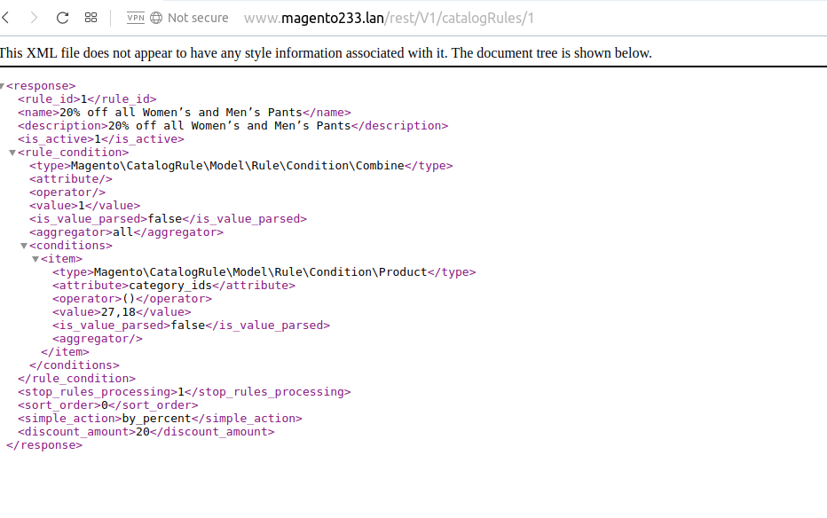

#  Create Catalog Price Rule in REST API In Magento 2
Magento 2 Catalog Price Rule is not exposed as a REST API End Point. Catalog Price Rule API feature is an important feature for those who work in Creating Mobile App and Third Party Integration. Though this feature is not available we can extend magento core with our custom code to expose this API End Point. Lets see how to achieve this with our custom code.

## Goal
- Create Catalog Price Rule in REST API
http://www.magento233.lan/rest/V1/catalogRules/1




## Step By Step Tutorials

- [app/code/Bdcrops/CatalogRuleApi/registration.php](registration.php)

    <details><summary>Source</summary>

    ```
    <?php
        \Magento\Framework\Component\ComponentRegistrar::register(
            \Magento\Framework\Component\ComponentRegistrar::MODULE,
            'Bdcrops_CatalogRuleApi',
            __DIR__
        );
    ```
    </details>


- [app/code/Bdcrops/CatalogRuleApi/etc/module.xml](etc/module.xml)

    <details><summary>Source</summary>

    ```
    <?xml version="1.0"?>
    <config xmlns:xsi="http://www.w3.org/2001/XMLSchema-instance" xsi:noNamespaceSchemaLocation="urn:magento:framework:Module/etc/module.xsd">
        <module name="Bdcrops_CatalogRuleApi" setup_version="1.0.0"/>
    </config>

    ```
    </details>


- [app/code/Bdcrops/CatalogRuleApi/etc/webapi.xml](etc/webapi.xml)

- [app/code/Bdcrops/CatalogRuleApi/Api/CatalogRuleRepositoryInterface.php](Api/CatalogRuleRepositoryInterface.php)

- [app/code/Bdcrops/CatalogRuleApi/etc/di.xml](etc/di.xml)

- Result
At this point now we can execute the below REST API methods V1/catalogRules/:ruleId GET, DELETE, POST, PUT. But the problem here is the GET Method returns data without website_ids and customer_group_ids as show in the below screenshot.


- []()


## Ref
- [mydons](http://mydons.com/magento-2-catalog-price-rule-in-rest-api/)
