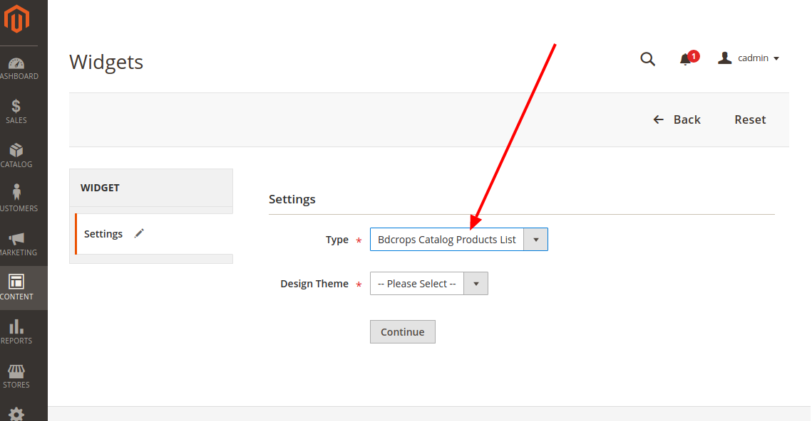

# Create New CatalogWidget


## Goal

- Create New CatalogWidget using Model & Block



## Step By Step Tutorials
- [app/code/Bdcrops/CatalogWidget/registration.php](registration.php)
```

```
- [app/code/Bdcrops/CatalogWidget/etc/module.xml](module.xml)
```

```
- [app/code/Bdcrops/CatalogWidget/etc/widget.xml](widget.xml)
```
<?xml version="1.0" encoding="UTF-8"?>
<widgets xmlns:xsi="http://www.w3.org/2001/XMLSchema-instance"
         xsi:noNamespaceSchemaLocation="urn:magento:module:Magento_Widget:etc/widget.xsd">
    <widget id="bdcrops_products_list" class="Bdcrops\CatalogWidget\Block\Product\ProductsList"
            placeholder_image="Bdcrops_CatalogWidget::images/bdcrops_widget_block.png">
        <label translate="true">Bdcrops Catalog Products List</label>
        <description>Bdcrops - Extended Catalog Products List</description>
        <parameters>
            <parameter name="title" xsi:type="text" required="false" visible="true">
                <label translate="true">Title</label>
            </parameter>
            <parameter name="collection_sort_by" xsi:type="select" visible="true"
                       source_model="Bdcrops\CatalogWidget\Model\Config\Source\SortBy">
                <label translate="true">Sort Collection By</label>
            </parameter>
            <parameter name="collection_sort_order" xsi:type="select" visible="true"
                       source_model="Bdcrops\CatalogWidget\Model\Config\Source\SortOrder">
                <label translate="true">Sort Collection Order</label></parameter>
            <parameter name="show_pager" xsi:type="select" visible="true"
                       source_model="Magento\Config\Model\Config\Source\Yesno">
                <label translate="true">Display Page Control</label>
            </parameter>
            <parameter name="products_per_page" xsi:type="text" required="true" visible="true">
                <label translate="true">Number of Products per Page</label>
                <depends>
                    <parameter name="show_pager" value="1" />
                </depends>
                <value>5</value>
            </parameter>
            <parameter name="products_count" xsi:type="text" required="true" visible="true">
                <label translate="true">Number of Products to Display</label>
                <value>10</value>
            </parameter>
            <parameter name="template" xsi:type="select" required="true" visible="true">
                <label translate="true">Template</label>
                <options>
                    <option name="default" value="Magento_CatalogWidget::product/widget/content/grid.phtml" selected="true">
                        <label translate="true">Products Grid Template</label>
                    </option>
                    <option name="top_products" value="Bdcrops_CatalogWidget::product/widget/content/top_products.phtml">
                        <label translate="true">Top Products Template</label>
                    </option>
                </options>
            </parameter>
            <parameter name="cache_lifetime" xsi:type="text" visible="true">
                <label translate="true">Cache Lifetime (Seconds)</label>
                <description translate="true">86400 by default, if not set. To refresh instantly, clear the Blocks HTML Output cache.</description>
            </parameter>
            <parameter name="condition" xsi:type="conditions" visible="true" required="true" sort_order="10"
                       class="Magento\CatalogWidget\Block\Product\Widget\Conditions">
                <label translate="true">Conditions</label>
            </parameter>
        </parameters>
        <containers>
            <container name="content">
                <template name="grid" value="default" />
                <template name="top-products" value="top_products" />
            </container>
            <container name="content.top">
                <template name="grid" value="default" />
            </container>
        </containers>
    </widget>
</widgets>

```
- [app/code/Bdcrops/CatalogWidget/Block/Product/ProductsList.php](Block/Product/ProductsList.php)
```
<?php
namespace Bdcrops\CatalogWidget\Block\Product;

class ProductsList extends \Magento\CatalogWidget\Block\Product\ProductsList
{
    const DEFAULT_COLLECTION_SORT_BY = 'name';
    const DEFAULT_COLLECTION_ORDER = 'asc';

    public function createCollection()
    {
        /** @var $collection \Magento\Catalog\Model\ResourceModel\Product\Collection */
        $collection = $this->productCollectionFactory->create();
        $collection->setVisibility($this->catalogProductVisibility->getVisibleInCatalogIds());

        $collection = $this->_addProductAttributesAndPrices($collection)
            ->addStoreFilter()
            ->setPageSize($this->getPageSize())
            ->setCurPage($this->getRequest()->getParam($this->getData('page_var_name'), 1))
            ->setOrder($this->getSortBy(), $this->getSortOrder());

        $conditions = $this->getConditions();
        $conditions->collectValidatedAttributes($collection);
        $this->sqlBuilder->attachConditionToCollection($collection, $conditions);

        return $collection;
    }

    public function getSortBy()
    {
        if (!$this->hasData('collection_sort_by')) {
            $this->setData('collection_sort_by', self::DEFAULT_COLLECTION_SORT_BY);
        }
        return $this->getData('collection_sort_by');
    }

    public function getSortOrder()
    {
        if (!$this->hasData('collection_sort_order')) {
            $this->setData('collection_sort_order', self::DEFAULT_COLLECTION_ORDER);
        }
        return $this->getData('collection_sort_order');
    }
}

```
- [app/code/Bdcrops/CatalogWidget/Model/Config/Source/SortBy.php](Model/Config/Source/SortBy.php)
```
<?php
namespace Bdcrops\CatalogWidget\Model\Config\Source;

class SortBy implements \Magento\Framework\Option\ArrayInterface
{
    public function toOptionArray()
    {
        return [
            ['value' => 'name', 'label' => __('Product Name')],
            ['value' => 'price', 'label' => __('Price')]
        ];
    }
}

```
- [app/code/Bdcrops/CatalogWidget/Model/Config/Source/SortOrder.php](Model/Config/Source/SortOrder.php)
```
<?php
namespace Bdcrops\CatalogWidget\Model\Config\Source;

class SortOrder implements \Magento\Framework\Option\ArrayInterface
{
    public function toOptionArray()
    {
        return [
            ['value' => 'asc', 'label' => __('Ascending')],
            ['value' => 'desc', 'label' => __('Descending')]
        ];
    }
}

```

## Ref

https://inchoo.net/magento-2/magento-2-custom-widget/
https://www.mageplaza.com/devdocs/magento-2-create-widget/
