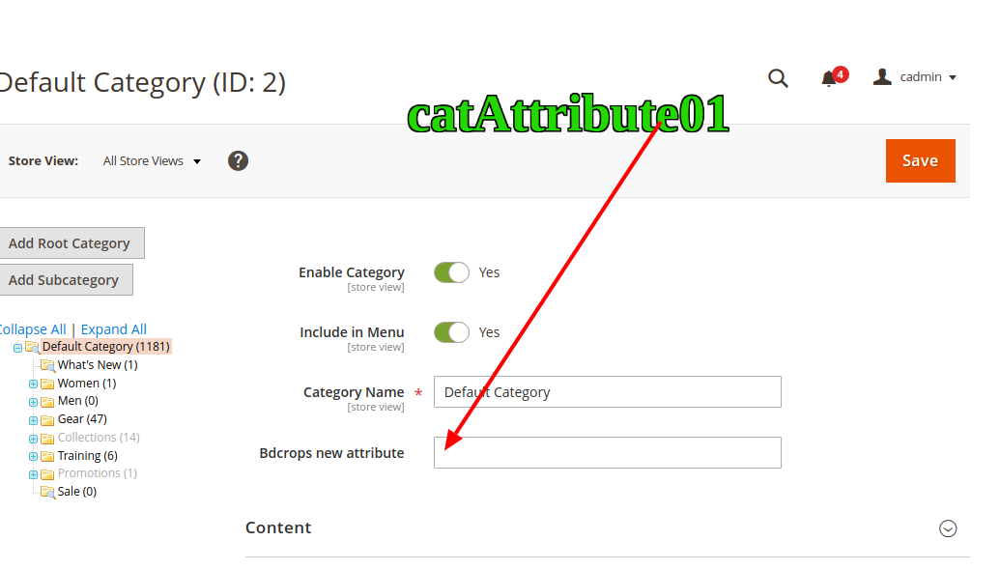

#  Create New CategoryAttributes Programmatically In Magento 2


## Goal
- Create New CategoryAttributes Using Setup db script.




## Step By Step Tutorials

- [app/code/Bdcrops/CategoryAttributes/registration.php](registration.php)

    <details><summary>Source</summary>

      ```
      <?php
          \Magento\Framework\Component\ComponentRegistrar::register(
              \Magento\Framework\Component\ComponentRegistrar::MODULE,
              'Bdcrops_CategoryAttributes',
              __DIR__
          );
      ```
    </details>


- Create [app/code/Bdcrops/CategoryAttributes/etc/module.xml](etc/module.xml)

  <details><summary>Source</summary>

      ```
      <?xml version="1.0"?>
      <config xmlns:xsi="http://www.w3.org/2001/XMLSchema-instance" xsi:noNamespaceSchemaLocation="urn:magento:framework:Module/etc/module.xsd">
      <module name="Bdcrops_CategoryAttributes" setup_version="1.0.0"/>
      </config>

      ```
  </details>

- Create [app/code/Bdcrops/CategoryAttributes/Setup/InstallData.php](Setup/InstallData.php)

  <details><summary>Source</summary>

      ```
      <?php
      namespace Bdcrops\CustomerAttribute\Setup;

      use Magento\Framework\Setup\InstallDataInterface;
      use Magento\Framework\Setup\ModuleContextInterface;
      use Magento\Framework\Setup\ModuleDataSetupInterface;
      use Magento\Eav\Setup\EavSetupFactory;

      class InstallData implements InstallDataInterface
      {

      	private $eavSetupFactory;

      	public function __construct(EavSetupFactory $eavSetupFactory)
      	{
      		$this->eavSetupFactory = $eavSetupFactory;
      	}

      	public function install(
      		ModuleDataSetupInterface $setup,
      		ModuleContextInterface $context
      	)
      	{
      		$eavSetup = $this->eavSetupFactory->create(['setup' => $setup]);

      		$eavSetup->addAttribute(
      			\Magento\Catalog\Model\Category::ENTITY,
      			'bdc_new_attribute',
      			[
      				'type'         => 'varchar',
      				'label'        => 'Bdcrops Attribute',
      				'input'        => 'text',
      				'sort_order'   => 100,
      				'source'       => '',
      				'global'       => 1,
      				'visible'      => true,
      				'required'     => false,
      				'user_defined' => false,
      				'default'      => null,
      				'group'        => '',
      				'backend'      => ''
      			]
      		);
      	}
      }
      ```
  </details>

- Create [view/adminhtml/ui_component/category_form.xml](view/adminhtml/ui_component/category_form.xml)

  <details><summary>Source</summary>

      ```
      <?xml version="1.0" ?>
      <form xmlns:xsi="http://www.w3.org/2001/XMLSchema-instance" xsi:noNamespaceSchemaLocation="urn:magento:module:Magento_Ui:etc/ui_configuration.xsd">
          <fieldset name="general">
              <field name="bdc_new_attribute">
                  <argument name="data" xsi:type="array">
                      <item name="config" xsi:type="array">
                          <item name="required" xsi:type="boolean">false</item>
                          <item name="validation" xsi:type="array">
                              <item name="required-entry" xsi:type="boolean">false</item>
                          </item>
                          <item name="sortOrder" xsi:type="number">333</item>
                          <item name="dataType" xsi:type="string">string</item>
                          <item name="formElement" xsi:type="string">input</item>
                          <item name="label" translate="true" xsi:type="string">Bdcrops new attribute</item>
                      </item>
                  </argument>
              </field>
          </fieldset>
      </form>


      ```
  </details>


## Ref

- [mageplaza](https://www.mageplaza.com/devdocs/magento-2-category-attributes-programmatically/)
