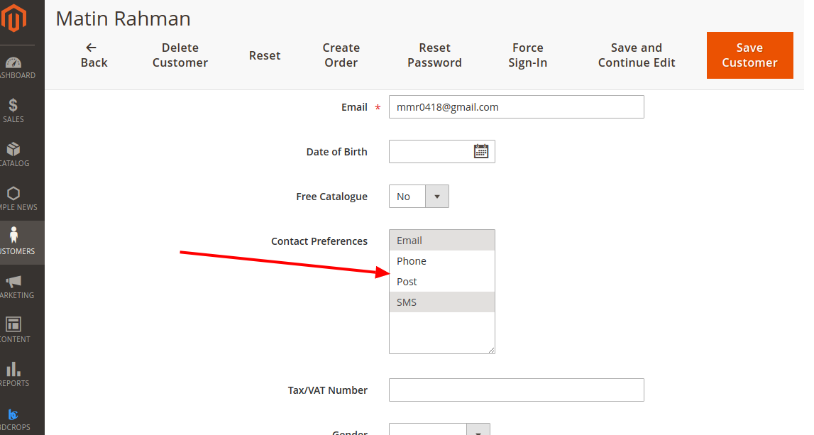
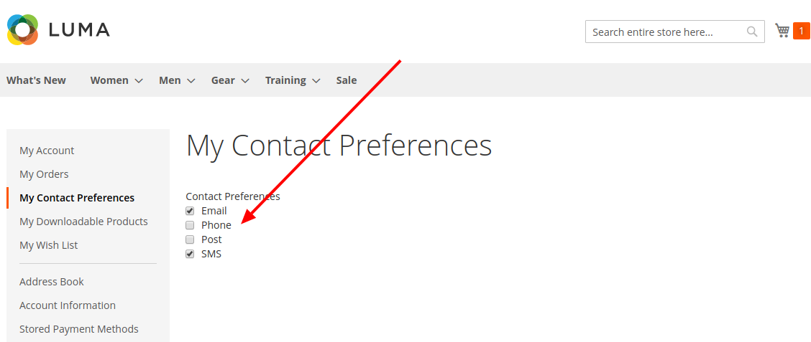
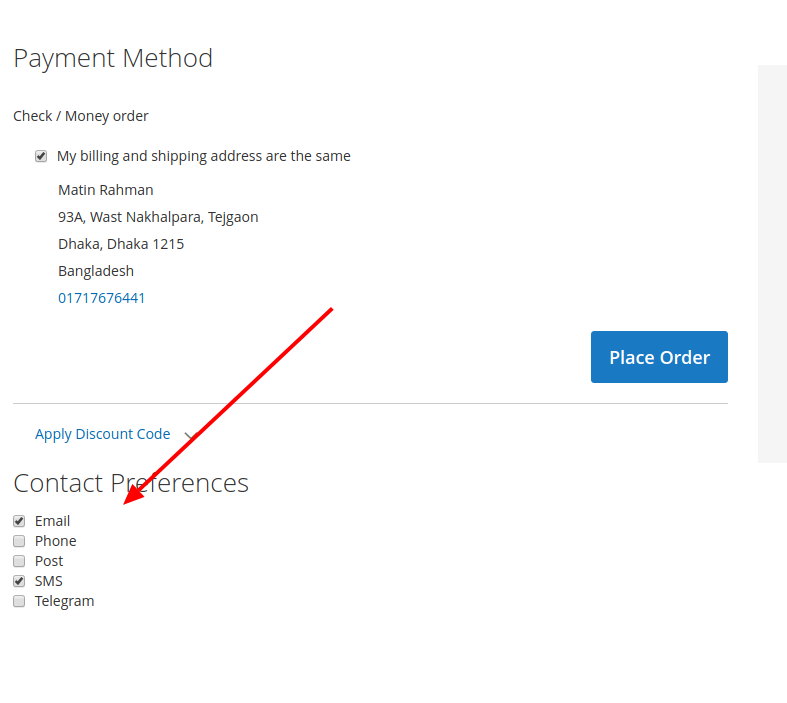
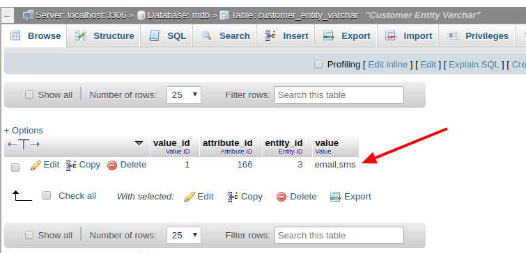

#  Create New ContactPreferences Programmatically In Magento 2


## Goal
- Create New ContactPreferences Using Setup db script.







## Step By Step Tutorials

- [app/code/Bdcrops/ContactPreferences/registration.php](registration.php)

    <details><summary>Source</summary>

      ```
      <?php
          \Magento\Framework\Component\ComponentRegistrar::register(
              \Magento\Framework\Component\ComponentRegistrar::MODULE,
              'Bdcrops_ContactPreferences',
              __DIR__
          );
      ```
    </details>


- Create [app/code/Bdcrops/ContactPreferences/etc/module.xml](etc/module.xml)

  <details><summary>Source</summary>

      ```
      <?xml version="1.0"?>
      <config xmlns:xsi="http://www.w3.org/2001/XMLSchema-instance" xsi:noNamespaceSchemaLocation="urn:magento:framework:Module/etc/module.xsd">
      <module name="Bdcrops_ContactPreferences" setup_version="1.0.0"/>
      </config>

      ```
  </details>

  - ContactPreferences/Controller/Contact/Preferences.php
  - ContactPreferences/CustomerData/Preferences.php
  - ContactPreferences/Model/Entity/Attribute/Source/Contact/Preferences.php
  - ContactPreferences/Setup/InstallData.php

  - ContactPreferences/etc/frontend/di.xml
  - ContactPreferences/etc/frontend/routes.xml
  - ContactPreferences/etc/frontend/sections.xml
  - ContactPreferences/etc/module.xml
  - ContactPreferences/readme.md
  - ContactPreferences/registration.php
  - ContactPreferences/view/frontend/layout/checkout_index_index.xml
  - ContactPreferences/view/frontend/layout/customer_account.xml
  - ContactPreferences/view/frontend/layout/customer_contact_preferences.xml
  - ContactPreferences/view/frontend/requirejs-config.js
  - ContactPreferences/view/frontend/templates/customer/contact/preferences.phtml
  - ContactPreferences/view/frontend/web/js/view/contact-preferences.js
  - ContactPreferences/view/frontend/web/template/contact-preferences.html


## Ref
