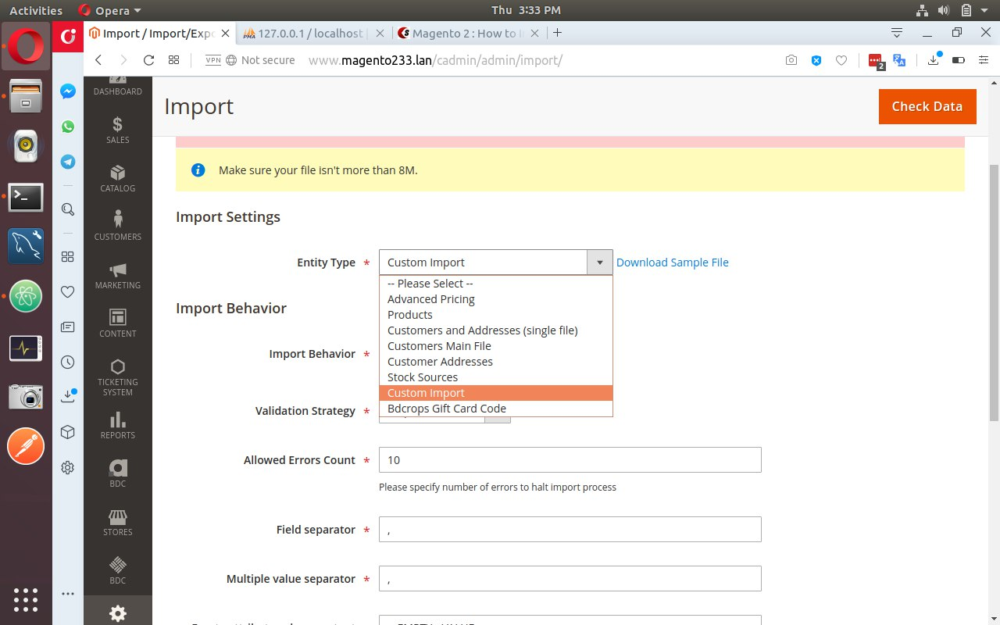

#  Create CustomImport In Magento 2


## Goal
- Create CustomImport.


[csv](docs/bdcrops_custom.csv)

## Step By Step Tutorials

- [app/code/Bdcrops/CustomImport/registration.php](registration.php)

    <details><summary>Source</summary>
    ```
    <?php
        \Magento\Framework\Component\ComponentRegistrar::register(
            \Magento\Framework\Component\ComponentRegistrar::MODULE,
            'Bdcrops_CustomImport',
            __DIR__
        );
    ```
    </details>


- [app/code/Bdcrops/CustomImport/etc/module.xml](etc/module.xml)
  <details><summary>Source</summary>

    ```
    <?xml version="1.0"?>
    <config xmlns:xsi="http://www.w3.org/2001/XMLSchema-instance" xsi:noNamespaceSchemaLocation="urn:magento:framework:Module/etc/module.xsd">
        <module name="Bdcrops_CustomImport" setup_version="1.0.0"/>
    </config>

    ```
  </details>
- [CustomImport/etc/db_schema.xml](etc/db_schema.xml)

  <details><summary>Source</summary>

      ```
      <?xml version="1.0"?>
      <schema xmlns:xsi="http://www.w3.org/2001/XMLSchema-instance" xsi:noNamespaceSchemaLocation="urn:magento:framework:Setup/Declaration/Schema/etc/schema.xsd">
         <table name="bdcrops_custom" resource="default" engine="innodb" comment="bdcrops declarative table">
              <column xsi:type="smallint" name="id" padding="6" unsigned="false" nullable="false" identity="true" comment="ID"/>
              <column xsi:type="varchar" name="name" nullable="false" length="25" comment="Name"/>
              <column xsi:type="varchar" name="description" nullable="false" length="255" comment="Descrition"/>
              <column xsi:type="timestamp" name="created"  comment="Time of event"/>
              <column xsi:type="timestamp" name="date_closed"  comment="Time of event"/>
              <constraint xsi:type="primary" referenceId="PRIMARY">   <column name="id"/> </constraint>
          </table>
      </schema>
      ```
  </details>

- Run
```
php bin/magento setup:db-declaration:generate-whitelist [options]
php bin/magento setup:db-declaration:generate-whitelist --module-name=vendor_module

php bin/magento setup:db-declaration:generate-whitelist --module-name=Bdcrops_CustomImport
php bin/magento setup:upgrade --dry-run=1 --keep-generated
php bin/magento setup:upgrade

```


[csv](docs/bdcrops_custom.csv)


## Ref
- [meetanshi](https://www.scommerce-mage.com/blog/magento-2-how-to-import-csv-to-custom-table.html)
