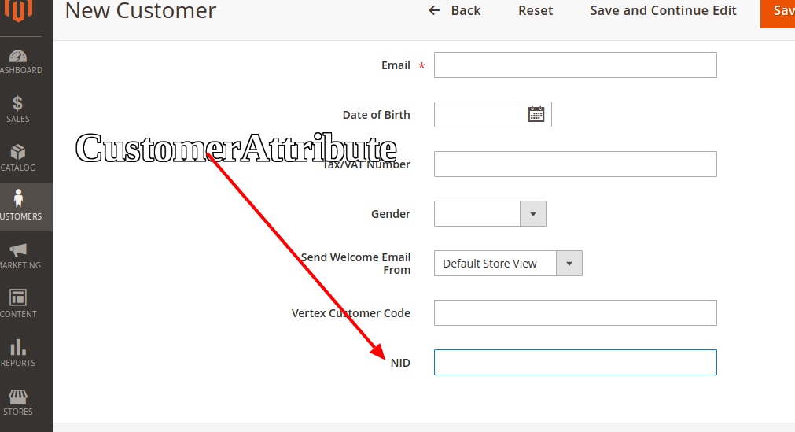

## Add Customer Attribute Programmatically

## Goal

- Add Customer Attribute Using DB Script



## Step By Step Tutorials

- [app/code/Bdcrops/CustomerAttribute/registration.php](registration.php)

- [app/code/Bdcrops/CustomerAttribute/etc/module.xml](etc/module.xml)

- [app/code/Bdcrops/CustomerAttribute/Setup/InstallData.php](Setup/InstallData.php)
```
<?php
namespace Bdcrops\CustomerAttribute\Setup;

use Magento\Eav\Setup\EavSetup;
use Magento\Eav\Setup\EavSetupFactory;
use Magento\Framework\Setup\InstallDataInterface;
use Magento\Framework\Setup\ModuleContextInterface;
use Magento\Framework\Setup\ModuleDataSetupInterface;
use Magento\Eav\Model\Config;
use Magento\Customer\Model\Customer;

class InstallData implements InstallDataInterface{
	private $eavSetupFactory;

	public function __construct(EavSetupFactory $eavSetupFactory, Config $eavConfig){
		$this->eavSetupFactory = $eavSetupFactory;
		$this->eavConfig       = $eavConfig;
	}

	public function install(ModuleDataSetupInterface $setup, ModuleContextInterface $context)
	{
		$eavSetup = $this->eavSetupFactory->create(['setup' => $setup]);
		$eavSetup->addAttribute(
			\Magento\Customer\Model\Customer::ENTITY,
			'nid',['type'         => 'varchar',
				'label'        => 'NID',
				'input'        => 'text', 'required'     => false,
				'visible'      => true, 'user_defined' => true,
				'position'     => 999, 'system'       => 0,]
		);
		$sampleAttribute = $this->eavConfig->getAttribute(Customer::ENTITY, 'nid');
		// more used_in_forms ['adminhtml_checkout','adminhtml_customer','adminhtml_customer_address','customer_account_edit','customer_address_edit','customer_register_address']
		$sampleAttribute->setData('used_in_forms',['adminhtml_customer']);
		$sampleAttribute->save();
	}
}

```


## Ref
[mageplaza](https://www.mageplaza.com/magento-2-module-development/magento-2-add-customer-attribute-programmatically.html)
