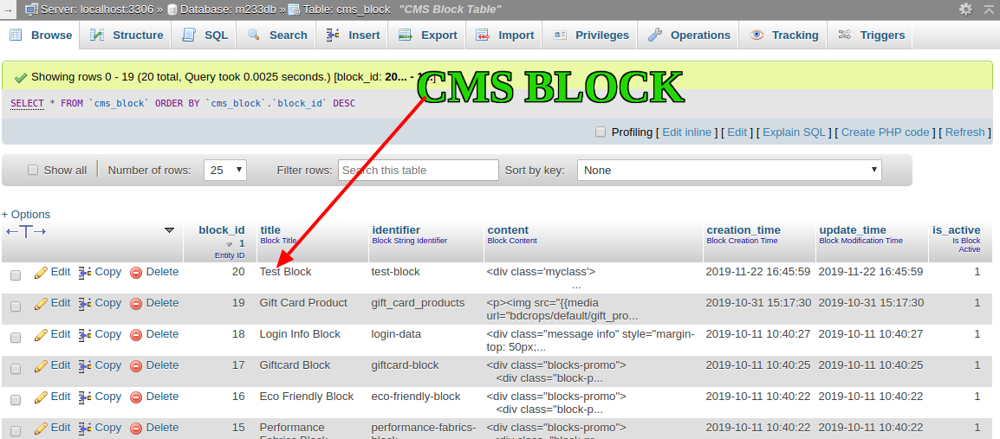
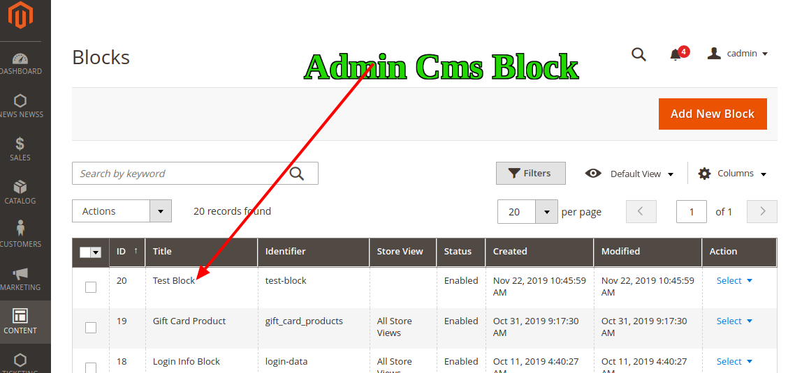

#  Add CMS Static Block from Data Patch  In Magento 2


## Goal
- Create New DataPatchBlock Using Setup Data Patch.





## Step By Step Tutorials

- Create [app/code/Bdcrops/DataPatchBlock/registration.php](registration.php)

    <details><summary>Source</summary>

      ```
      <?php
          \Magento\Framework\Component\ComponentRegistrar::register(
              \Magento\Framework\Component\ComponentRegistrar::MODULE,
              'Bdcrops_DataPatchBlock',
              __DIR__
          );
      ```
    </details>


- Create [app/code/Bdcrops/DataPatchBlock/etc/module.xml](etc/module.xml)

  <details><summary>Source</summary>

      ```
      <?xml version="1.0"?>
      <config xmlns:xsi="http://www.w3.org/2001/XMLSchema-instance" xsi:noNamespaceSchemaLocation="urn:magento:framework:Module/etc/module.xsd">
      <module name="Bdcrops_DataPatchBlock" setup_version="1.0.0"/>
      </config>

      ```
  </details>

- Create [Setup/Patch/Data/TestBlockData.php](Setup/Patch/Data/TestBlockData.php)

    ```
    //generate patch
    //php bin/magento help setup:db-declaration:generate-patch
    php bin/magento setup:db-declaration:generate-patch Bdcrops_DataPatchBlock TestBlockData --type=data
    php bin/magento setup:db-declaration:generate-patch Bdcrops_DataPatchBlock Example --type=schema
    php bin/magento setup:upgrade

    ```
    Add Blow Code:

    ```
    public function apply() {
    $data = [
    'title' => 'Test Block',
    'identifier' => 'test-block',
    'content' => "<div class='myclass'>
            <ul>
                <li>Item 1</li>
                <li>Item 2</li>
                <li>Item 3</li>
            </ul>
        </div>",
    'is_active' => 1
    ];
    $this->moduleDataSetup->getConnection()->insert('cms_block', $data);
    }
    ```

  <details><summary>Source</summary>

      ```
      <?php
      /**
       * Copyright © Magento, Inc. All rights reserved.
       * See COPYING.txt for license details.
       */

      namespace Bdcrops\DataPatchBlock\Setup\Patch\Data;

      use Magento\Framework\Setup\Patch\DataPatchInterface;
      use Magento\Framework\Setup\Patch\SchemaPatchInterface;
      use Magento\Framework\Setup\Patch\PatchRevertableInterface;
      use Magento\Framework\Setup\ModuleDataSetupInterface;

      /**
      * Patch is mechanism, that allows to do atomic upgrade data changes
      */
      class TestBlockData implements   DataPatchInterface {
          /**
           * @var ModuleDataSetupInterface $moduleDataSetup
           */
          private $moduleDataSetup;

          /**
           * @param ModuleDataSetupInterface $moduleDataSetup
           */
          public function __construct(ModuleDataSetupInterface $moduleDataSetup)
          {
              $this->moduleDataSetup = $moduleDataSetup;
          }

          /**
           * Do Upgrade
           *
           * @return void
           */
          public function apply() {
            $data = [
                      'title' => 'Test Block',
                      'identifier' => 'test-block',
                      'content' => "<div class='myclass'>
                                      <ul>
                                          <li>Item 1</li>
                                          <li>Item 2</li>
                                          <li>Item 3</li>
                                      </ul>
                                  </div>",
                      'is_active' => 1
                  ];
            $this->moduleDataSetup->getConnection()->insert('cms_block', $data);
          }

          /**
           * {@inheritdoc}
           */
          public function getAliases()
          {
              return [];
          }

          /**
           * {@inheritdoc}
           */
          public static function getDependencies()
          {
              return [

              ];
          }
      }

      ```
  </details>

## Ref
- [](https://blog.chapagain.com.np/magento-2-add-update-cms-static-block-via-install-upgrade-script-programmatically/)
