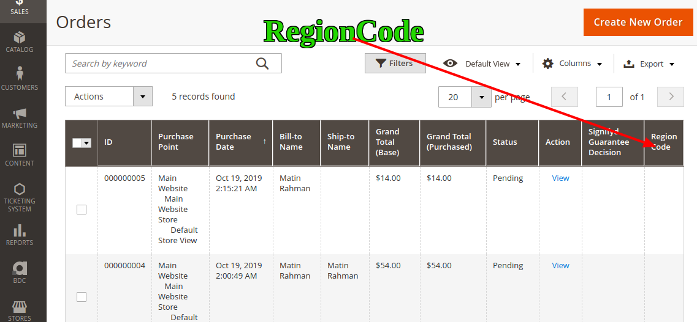
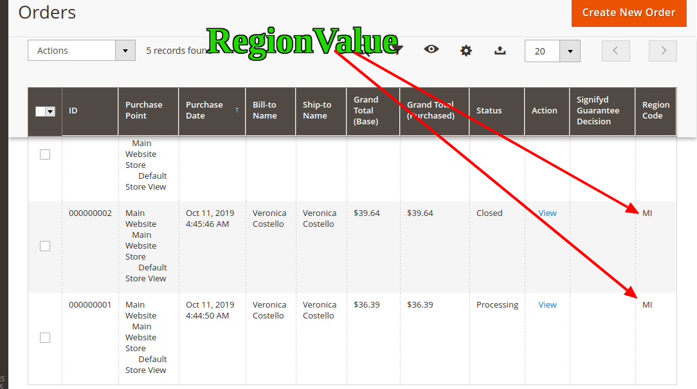

# Extended Orders Grid In Magento 2

We need to add a column ― with some regional code of a customer who completed a purchase ― to the orders grid. Additionally, a store administrator must have a possibility to filter orders by this newly added column.





## Goal
- Extended Orders Grid By Ui & Plugins


## Step By Step Tutorials

- [app/code/Bdcrops/ExtendedOrdersGrid/registration.php](registration.php)

    <details><summary>Source</summary>
    ```
    <?php
        \Magento\Framework\Component\ComponentRegistrar::register(
            \Magento\Framework\Component\ComponentRegistrar::MODULE,
            'Bdcrops_ExtendedOrdersGrid',
            __DIR__
        );
    ```
    </details>


- [app/code/Bdcrops/ExtendedOrdersGrid/etc/module.xml](etc/module.xml)
```
<?xml version="1.0"?>
<config xmlns:xsi="http://www.w3.org/2001/XMLSchema-instance" xsi:noNamespaceSchemaLocation="urn:magento:framework:Module/etc/module.xsd">
    <module name="Bdcrops_ExtendedOrdersGrid" setup_version="1.0.0"/>
</config>

```


## Ref
- [mageworx](https://www.mageworx.com/blog/how-to-add-column-with-filter-to-magento-2-orders-grid/)
- [github](https://github.com/mageworx/articles-extended-orders-grid)
