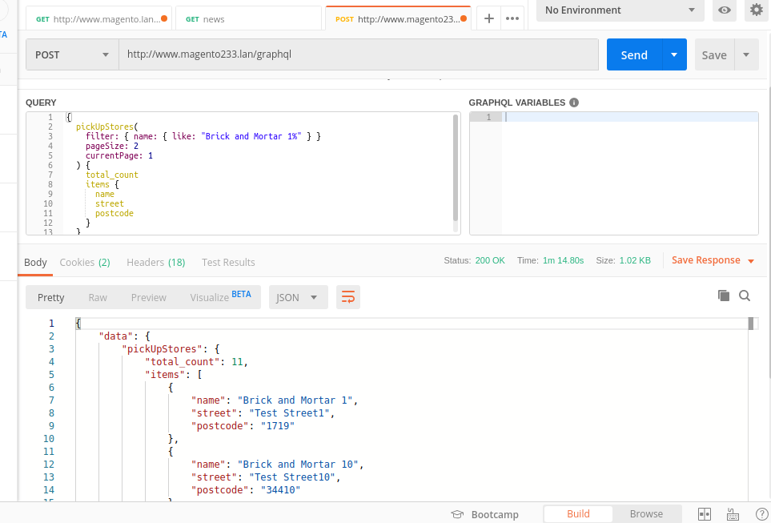

#  Create New GraphQLStorePickup  In Magento 2


## Goal
- Create New GraphQLStorePickup Using Setup db script.




## Step By Step Tutorials

- Create [app/code/Bdcrops/GraphQLStorePickup/registration.php](registration.php)

    <details><summary>Source</summary>

      ```
      <?php
          \Magento\Framework\Component\ComponentRegistrar::register(
              \Magento\Framework\Component\ComponentRegistrar::MODULE,
              'Bdcrops_GraphQLStorePickup',
              __DIR__
          );
      ```
    </details>


- Create [app/code/Bdcrops/GraphQLStorePickup/etc/module.xml](etc/module.xml)

  <details><summary>Source</summary>

      ```
      <?xml version="1.0"?>
      <config xmlns:xsi="http://www.w3.org/2001/XMLSchema-instance" xsi:noNamespaceSchemaLocation="urn:magento:framework:Module/etc/module.xsd">
      <module name="Bdcrops_GraphQLStorePickup" setup_version="1.0.0"/>
      </config>

      ```
  </details>

- [etc/db_schema.xml](etc/db_schema.xml)
  <details><summary>Source</summary>

      ```
      <?xml version="1.0"?>
      <schema xmlns:xsi="http://www.w3.org/2001/XMLSchema-instance" xsi:noNamespaceSchemaLocation="urn:magento:framework:Setup/Declaration/Schema/etc/schema.xsd">
          <table name="pickup_stores" resource="default" engine="innodb" comment="Pick Up Stores">
              <column xsi:type="int" name="entity_id" padding="10" unsigned="true" nullable="false" identity="true"
                      comment="Entity ID"/>
              <column xsi:type="varchar" name="name" nullable="true" length="64"/>
              <column xsi:type="varchar" name="street" nullable="true" length="64"/>
              <column xsi:type="int" name="street_num" nullable="true"/>
              <column xsi:type="varchar" name="city" nullable="true" length="64"/>
              <column xsi:type="varchar" name="postcode" nullable="true" length="10"/>
              <column xsi:type="decimal" name="latitude"  default="0" scale="4" precision="20" />
              <column xsi:type="decimal" name="longitude"  default="0" scale="4" precision="20" />
              <constraint xsi:type="primary" referenceId="PRIMARY"><column name="entity_id"/> </constraint>
          </table>
      </schema>

      ```
  </details>

- [Setup/Patch/Data/InitializePickUpStores.php](Setup/Patch/Data/InitializePickUpStores.php)
  <details><summary>Source</summary>

      ```
      <?php

      declare(strict_types=1);

      namespace Bdcrops\GraphQLStorePickup\Setup\Patch\Data;

      use Bdcrops\GraphQLStorePickup\Api\Data\StoreInterface;
      use Bdcrops\GraphQLStorePickup\Api\Data\StoreInterfaceFactory;
      use Bdcrops\GraphQLStorePickup\Api\StoreRepositoryInterface;
      use Magento\Framework\Api\DataObjectHelper;
      use Magento\Framework\Setup\ModuleDataSetupInterface;
      use Magento\Framework\Setup\Patch\DataPatchInterface;

      class InitializePickUpStores implements DataPatchInterface
      {
          /**
           * @var ModuleDataSetupInterface
           */
          private $moduleDataSetup;
          /**
           * @var StoreInterfaceFactory
           */
          private $storeInterfaceFactory;
          /**
           * @var StoreRepositoryInterface
           */
          private $storeRepository;
          /**
           * @var DataObjectHelper
           */
          private $dataObjectHelper;

          /**
           * EnableSegmentation constructor.
           *
           * @param ModuleDataSetupInterface $moduleDataSetup
           */
          public function __construct(
              ModuleDataSetupInterface $moduleDataSetup,
              StoreInterfaceFactory $storeInterfaceFactory,
              StoreRepositoryInterface $storeRepository,
              DataObjectHelper $dataObjectHelper
          ) {
              $this->moduleDataSetup = $moduleDataSetup;
              $this->storeInterfaceFactory = $storeInterfaceFactory;
              $this->storeRepository = $storeRepository;
              $this->dataObjectHelper = $dataObjectHelper;
          }

          /**
           * {@inheritdoc}
           */
          public static function getDependencies()
          {
              return [];
          }

          /**
           * {@inheritdoc}
           * @throws Exception
           * @throws Exception
           */
          public function apply()
          {
              $this->moduleDataSetup->startSetup();
              $maxStore = 50;

              $citys = ['Banful', 'West Nakhalpara', 'Tejgaon', 'Dhaka', 'Bangladesh'];

              for ($i = 1; $i <= $maxStore; $i++) {

                  $storeData = [
                      StoreInterface::NAME => 'Brick and Mortar ' . $i,
                      StoreInterface::STREET => 'Test Street' . $i,
                      StoreInterface::STREET_NUM => $i * random_int(1, 100),
                      StoreInterface::CITY => $citys[random_int(0, 4)],
                      StoreInterface::POSTCODE => $i * random_int(1000, 9999),
                      StoreInterface::LATITUDE => random_int(4757549, 5041053) / 100000,
                      StoreInterface::LONGITUDE => random_int(1157549, 1341053) / 100000,
                  ];
                  /** @var StoreInterface $store */
                  $store = $this->storeInterfaceFactory->create();
                  $this->dataObjectHelper->populateWithArray($store, $storeData, StoreInterface::class);
                  $this->storeRepository->save($store);
              }

              $this->moduleDataSetup->endSetup();
          }

          /**
           * {@inheritdoc}
           */
          public function getAliases()
          {
              return [];
          }
      }

      ```
  </details>

    ```
    php bin/magento setup:db-declaration:generate-whitelist [options]
    php bin/magento setup:db-declaration:generate-whitelist --module-name=vendor_module

    php bin/magento setup:db-declaration:generate-whitelist --module-name=Bdcrops_GraphQLStorePickup
    php bin/magento setup:upgrade --dry-run=1 --keep-generated
    php bin/magento setup:upgrade

    ```

- [Api/Data/StoreInterface.php](Api/Data/StoreInterface.php)
  <details><summary>Source</summary>

      ```
      <?php

      declare(strict_types=1);

      namespace Bdcrops\GraphQLStorePickup\Api\Data;

      /**
       * Represents a store and properties
       *
       * @api
       */
      interface StoreInterface {
          /**
           * Constants for keys of data array. Identical to the name of the getter in snake case
           */
          const NAME = 'name';
          const STREET = 'street';
          const STREET_NUM = 'street_num';
          const CITY = 'city';
          const POSTCODE = 'postcode';
          const LATITUDE = 'latitude';
          const LONGITUDE = 'longitude';

          /**#@-*/

          public function getName(): ?string;

          public function setName(?string $name): void;

          public function getStreet(): ?string;

          public function setStreet(?string $street): void;

          public function getStreetNum(): ?int;

          public function setStreetNum(?int $streetNum): void;

          public function getCity(): ?string;

          public function setCity(?string $city): void;

          public function getPostCode(): ?int;

          public function setPostcode(?int $postCode): void;

          public function getLatitude(): ?float;

          public function setLatitude(?float $latitude): void;

          public function getLongitude(): ?float;

          public function setLongitude(?float $longitude): void;
      }

      ```
  </details>
- [Api/StoreRepositoryInterface.php](Api/StoreRepositoryInterface.php)
  <details><summary>Source</summary>

      ```
      <?php
      declare(strict_types=1);

      namespace Bdcrops\GraphQLStorePickup\Api;

      use Bdcrops\GraphQLStorePickup\Api\Data\StoreInterface;
      use Magento\Framework\Api\SearchCriteriaInterface;
      use Magento\Framework\Api\SearchResultsInterface;

      /**
       * @api
       */
      interface StoreRepositoryInterface {
          /**
           * Save the Store data.
           *
           * @param \Magento\InventoryApi\Api\Data\SourceInterface $source
           * @return void
           * @throws \Magento\Framework\Exception\CouldNotSaveException
           */
          public function save(StoreInterface $store): void;

          /**
           * Find Stores by given SearchCriteria
           * SearchCriteria is not required because load all stores is useful case
           *
           * @param \Magento\Framework\Api\SearchCriteriaInterface|null $searchCriteria
           * @return \Magento\Framework\Api\SearchResultsInterface
           */
          public function getList(SearchCriteriaInterface $searchCriteria = null): SearchResultsInterface;
      }

      ```
  </details>

- [Model/Resolver/FilterArgument.php](Model/Resolver/FilterArgument.php)
  <details><summary>Source</summary>

      ```
      <?php
      declare(strict_types=1);

      namespace Bdcrops\GraphQLStorePickup\Model\Resolver;

      use Magento\Framework\GraphQl\Config\Element\Field;
      use Magento\Framework\GraphQl\ConfigInterface;
      use Magento\Framework\GraphQl\Query\Resolver\Argument\FieldEntityAttributesInterface;

      class FilterArgument implements FieldEntityAttributesInterface {
          /** @var ConfigInterface */
          private $config;

          public function __construct(ConfigInterface $config)
          {
              $this->config = $config;
          }

          public function getEntityAttributes(): array
          {
              $fields = [];
              /** @var Field $field */
              foreach ($this->config->getConfigElement('PickUpStore')->getFields() as $field) {
                  $fields[$field->getName()] = '';
              }

              return array_keys($fields);
          }
      }

      ```
  </details>

- [Model/Resolver/PickUpStores.php](Model/Resolver/PickUpStores.php)
  <details><summary>Source</summary>

      ```
      <?php

      declare(strict_types=1);

      namespace Bdcrops\GraphQLStorePickup\Model\Resolver;

      use Bdcrops\GraphQLStorePickup\Api\StoreRepositoryInterface;
      use Bdcrops\GraphQLStorePickup\Model\Store\GetList;
      use Magento\Framework\GraphQl\Config\Element\Field;
      use Magento\Framework\GraphQl\Exception\GraphQlInputException;
      use Magento\Framework\GraphQl\Query\Resolver\Argument\SearchCriteria\Builder as SearchCriteriaBuilder;
      use Magento\Framework\GraphQl\Query\ResolverInterface;
      use Magento\Framework\GraphQl\Schema\Type\ResolveInfo;

      class PickUpStores implements ResolverInterface {

          /**
           * @var GetListInterface
           */
          private $storeRepository;
          /**
           * @var SearchCriteriaBuilder
           */
          private $searchCriteriaBuilder;

          /**
           * PickUpStoresList constructor.
           * @param GetList $storeRepository
           * @param SearchCriteriaBuilder $searchCriteriaBuilder
           */
          public function __construct(StoreRepositoryInterface $storeRepository, SearchCriteriaBuilder $searchCriteriaBuilder)
          {
              $this->storeRepository = $storeRepository;
              $this->searchCriteriaBuilder = $searchCriteriaBuilder;
          }

          /**
           * @inheritdoc
           */
          public function resolve(Field $field, $context, ResolveInfo $info, array $value = null, array $args = null)
          {

              $this->vaildateArgs($args);

              $searchCriteria = $this->searchCriteriaBuilder->build('pickup_stores', $args);
              $searchCriteria->setCurrentPage($args['currentPage']);
              $searchCriteria->setPageSize($args['pageSize']);
              $searchResult = $this->storeRepository->getList($searchCriteria);

              return [
                  'total_count' => $searchResult->getTotalCount(),
                  'items' => $searchResult->getItems(),
              ];
          }

          /**
           * @param array $args
           * @throws GraphQlInputException
           */
          private function vaildateArgs(array $args): void
          {
              if (isset($args['currentPage']) && $args['currentPage'] < 1) {
                  throw new GraphQlInputException(__('currentPage value must be greater than 0.'));
              }

              if (isset($args['pageSize']) && $args['pageSize'] < 1) {
                  throw new GraphQlInputException(__('pageSize value must be greater than 0.'));
              }
          }
      }

      ```
  </details>
- [Model/ResourceModel/Store.php](Model/ResourceModel/Store.php)
  <details><summary>Source</summary>

      ```
      <?php
      declare(strict_types=1);

      namespace Bdcrops\GraphQLStorePickup\Model\ResourceModel;

      use Magento\Framework\Model\ResourceModel\Db\AbstractDb;
      use Magento\Framework\Model\ResourceModel\PredefinedId;

      class Store extends AbstractDb {
          /**
           * Provides possibility of saving entity with predefined/pre-generated id
           */
          use PredefinedId;

          /**#@+
           * Constants related to specific db layer
           */
          private const TABLE_NAME_STOCK = 'pickup_stores';
          /**#@-*/

          /**
           * @inheritdoc
           */
          protected function _construct()
          {
              $this->_init(self::TABLE_NAME_STOCK, 'entity_id');
          }
      }

      ```
  </details>
- [Model/ResourceModel/StoreCollection.php](Model/ResourceModel/StoreCollection.php)
  <details><summary>Source</summary>

      ```
      <?php
      declare(strict_types=1);

      namespace Bdcrops\GraphQLStorePickup\Model\ResourceModel;

      use Bdcrops\GraphQLStorePickup\Model\ResourceModel\Store as StoreResourceModel;
      use Bdcrops\GraphQLStorePickup\Model\Store as StoreModel;
      use Magento\Framework\Model\ResourceModel\Db\Collection\AbstractCollection;

      class StoreCollection extends AbstractCollection
      {
          /**
           * @inheritdoc
           */
          protected function _construct()
          {
              $this->_init(StoreModel::class, StoreResourceModel::class);
          }
      }

      ```
  </details>
- [Model/Store.php](Model/Store.php)
  <details><summary>Source</summary>

      ```
      <?php

      declare(strict_types=1);

      namespace Bdcrops\GraphQLStorePickup\Model;

      use Bdcrops\GraphQLStorePickup\Api\Data\StoreInterface;
      use Bdcrops\GraphQLStorePickup\Model\ResourceModel\Store as StoreResourceModel;
      use Magento\Framework\Model\AbstractExtensibleModel;

      class Store extends AbstractExtensibleModel implements StoreInterface
      {

          protected function _construct()
          {
              $this->_init(StoreResourceModel::class);
          }

          public function getName(): ?string
          {
              return $this->getData(self::NAME);
          }

          public function setName(?string $name): void
          {
              $this->setData(self::NAME, $name);
          }

          public function getStreet(): ?string
          {
              return $this->getData(self::STREET);
          }

          public function setStreet(?string $street): void
          {
              $this->setData(self::STREET, $street);
          }

          public function getStreetNum(): ?int
          {
              return $this->getData(self::STREET_NUM);
          }

          public function setStreetNum(?int $streetNum): void
          {
              $this->setData(self::STREET_NUM, $streetNum);
          }

          public function getCity(): ?string
          {
              return $this->getData(self::CITY);
          }

          public function setCity(?string $city): void
          {
              $this->setData(self::CITY, $city);
          }

          public function getPostCode(): ?int
          {
              return $this->getData(self::POSTCODE);
          }

          public function setPostcode(?int $postCode): void
          {
              $this->setData(self::POSTCODE, $postCode);
          }

          public function getLatitude(): ?float
          {
              return $this->getData(self::LATITUDE);
          }

          public function setLatitude(?float $latitude): void
          {
              $this->setData(self::LATITUDE, $latitude);
          }

          public function getLongitude(): ?float
          {
              return $this->getData(self::LONGITUDE);
          }

          public function setLongitude(?float $longitude): void
          {
              $this->setData(self::LONGITUDE, $longitude);
          }
      }

      ```
  </details>
- [Model/StoreRepository.php](Model/StoreRepository.php)
  <details><summary>Source</summary>

      ```
      <?php
      declare(strict_types=1);

      namespace Bdcrops\GraphQLStorePickup\Model;

      use Bdcrops\GraphQLStorePickup\Api\Data\StoreInterface;
      use Bdcrops\GraphQLStorePickup\Api\StoreRepositoryInterface;
      use Bdcrops\GraphQLStorePickup\Model\ResourceModel\Store as StoreResourceModel;
      use Bdcrops\GraphQLStorePickup\Model\ResourceModel\StoreCollection;
      use Bdcrops\GraphQLStorePickup\Model\ResourceModel\StoreCollectionFactory;
      use Magento\Framework\Api\Search\SearchCriteriaBuilder;
      use Magento\Framework\Api\SearchCriteria\CollectionProcessorInterface;
      use Magento\Framework\Api\SearchCriteriaInterface;
      use Magento\Framework\Api\SearchResultsInterface;
      use Magento\Framework\Api\SearchResultsInterfaceFactory;
      use Magento\Framework\Exception\CouldNotSaveException;

      class StoreRepository implements StoreRepositoryInterface
      {
          /**
           * @var StoreCollectionFactory
           */
          private $storeCollectionFactory;
          /**
           * @var CollectionProcessorInterface
           */
          private $collectionProcessor;
          /**
           * @var SearchCriteriaBuilder
           */
          private $searchCriteriaBuilder;
          /**
           * @var SearchResultsInterfaceFactory
           */
          private $storeSearchResultsInterfaceFactory;
          /**
           * @var StoreResourceModel
           */
          private $storeResourceModel;

          public function __construct(
              StoreCollectionFactory $storeCollectionFactory,
              CollectionProcessorInterface $collectionProcessor,
              SearchCriteriaBuilder $searchCriteriaBuilder,
              SearchResultsInterfaceFactory $storeSearchResultsInterfaceFactory,
              StoreResourceModel $storeResourceModel
          ) {
              $this->storeCollectionFactory = $storeCollectionFactory;
              $this->collectionProcessor = $collectionProcessor;
              $this->searchCriteriaBuilder = $searchCriteriaBuilder;
              $this->storeSearchResultsInterfaceFactory = $storeSearchResultsInterfaceFactory;
              $this->storeResourceModel = $storeResourceModel;
          }

          /**
           * @inheritDoc
           */
          public function getList(SearchCriteriaInterface $searchCriteria = null): SearchResultsInterface
          {
              /** @var StoreCollection $storeCollection */
              $storeCollection = $this->storeCollectionFactory->create();
              if (null === $searchCriteria) {
                  $searchCriteria = $this->searchCriteriaBuilder->create();
              } else {
                  $this->collectionProcessor->process($searchCriteria, $storeCollection);
              }
              /** @var SearchResultsInterface $searchResult */
              $searchResult = $this->storeSearchResultsInterfaceFactory->create();
              $searchResult->setItems($storeCollection->getItems());
              $searchResult->setTotalCount($storeCollection->getSize());
              $searchResult->setSearchCriteria($searchCriteria);

              return $searchResult;
          }

          /**
           * @inheritDoc
           */
          public function save(StoreInterface $store): void
          {
              try {
                  $this->storeResourceModel->save($store);
              } catch (\Exception $e) {
                  throw new CouldNotSaveException(__('Could not save Source'), $e);
              }
          }
      }

      ```
  </details>
- [etc/di.xml](etc/di.xml)
  <details><summary>Source</summary>

      ```
      <config xmlns:xsi="http://www.w3.org/2001/XMLSchema-instance" xsi:noNamespaceSchemaLocation="urn:magento:framework:ObjectManager/etc/config.xsd">
          <preference for="Bdcrops\GraphQLStorePickup\Api\Data\StoreInterface" type="Bdcrops\GraphQLStorePickup\Model\Store"/>
          <preference for="Bdcrops\GraphQLStorePickup\Api\StoreRepositoryInterface" type="\Bdcrops\GraphQLStorePickup\Model\StoreRepository"/>
          <type name="Magento\Framework\GraphQl\Query\Resolver\Argument\FieldEntityAttributesPool">
              <arguments>
                  <argument name="attributesInstances" xsi:type="array">
                      <item name="pickup_stores" xsi:type="object">
                          \Bdcrops\GraphQLStorePickup\Model\Resolver\FilterArgument
                      </item>
                  </argument>
              </arguments>
          </type>
      </config>

      ```
  </details>

- [etc/schema.graphqls](etc/schema.graphqls)
    <details><summary>Source</summary>

        ```
        type Query {
            pickUpStores(
                filter: PickUpStoresFilterInput @doc(description: "")
                pageSize: Int = 5 @doc(description: "How many items should show on the page")
                currentPage: Int = 1 @doc(description: "Allows to ussing paging it start with 1")
            ):pickUpStoresOutput @resolver(class: "\\Bdcrops\\GraphQLStorePickup\\Model\\Resolver\\PickUpStores") @doc(description: "The Impelemention to resolve PickUp stores")
        }

        input PickUpStoresFilterInput {
            name: FilterTypeInput  @doc(description: "")
            postcode: FilterTypeInput @doc(description: ""),
            latitude:FilterTypeInput @doc(description: ""),
            longitude: FilterTypeInput @doc(description: ""),
            or: PickUpStoresFilterInput
        }

        type pickUpStoresOutput {
            total_count:  Int @doc(description: "")
            items: [PickUpStore] @doc(description: "")
        }

        type PickUpStore {
            name: String @doc(description: ""),
            street: String @doc(description: ""),
            street_num: Int @doc(description: ""),
            city: String @doc(description: ""),
            postcode: String @doc(description: ""),
            latitude:Float @doc(description: ""),
            longitude: Float @doc(description: ""),
        }

        ```
    </details>

- Result: You may be use postman to show  GraphQL Store Pickup Data (Browser can't show)


...Happy QraphQL ....


## Ref
- [1](https://larsroettig.dev/how-to-create-a-graph-ql-endpoint-for-magento-2-3)
