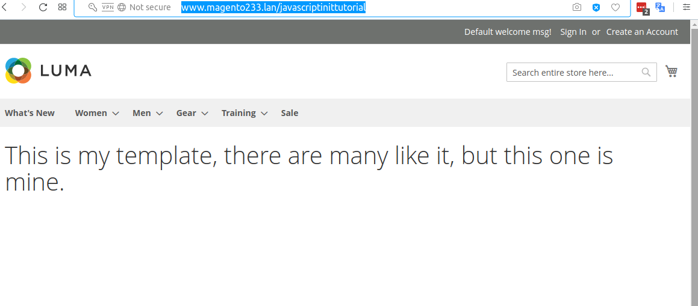

#  Create JavascriptInitTutorial In Magento 2


## Goal
- Create JavascriptInitTutorial



## Step By Step Tutorials

- [app/code/Bdcrops/JavascriptInitTutorial/registration.php](registration.php)

    <details><summary>Source</summary>
    ```
    <?php
        \Magento\Framework\Component\ComponentRegistrar::register(
            \Magento\Framework\Component\ComponentRegistrar::MODULE,
            'Bdcrops_vs',
            __DIR__
        );
    ```
    </details>


## Ref
```
php pestle.phar generate_module Bdcrops JavascriptInitTutorial 1.0.0
php pestle.phar generate_route Bdcrops_JavascriptInitTutorial frontend javascriptinittutorial
php pestle.phar generate_view Bdcrops_JavascriptInitTutorial frontend javascriptinittutorial_index_index Main content.phtml 1column
php bin/magento module:enable Bdcrops_JavascriptInitTutorial
php bin/magento setup:upgrade
http://www.magento233.lan/javascriptinittutorial
```
- [alanstorm](https://alanstorm.com/magento_2_javascript_init_scripts/)
