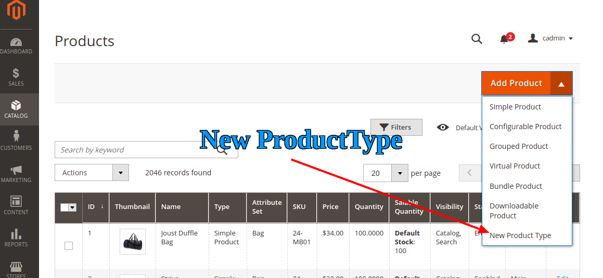

## Create New Product Type Programmatically

## Goal

- Add New Product Type Using Model & product_types.xml



## Step By Step Tutorials


<details><summary>Source</summary>

```<?php
    \Magento\Framework\Component\ComponentRegistrar::register(
        \Magento\Framework\Component\ComponentRegistrar::MODULE,
        'Bdcrops_NewproductType',
        __DIR__
    );
```
</details>


- [app/code/Bdcrops/NewproductType/registration.php](registration.php)

```
<?php
    \Magento\Framework\Component\ComponentRegistrar::register(
        \Magento\Framework\Component\ComponentRegistrar::MODULE,
        'Bdcrops_NewproductType',
        __DIR__
    );
```
- [app/code/Bdcrops/NewproductType/etc/module.xml](etc/module.xml)
```
<?xml version="1.0"?>
<config xmlns:xsi="http://www.w3.org/2001/XMLSchema-instance" xsi:noNamespaceSchemaLocation="urn:magento:framework:Module/etc/module.xsd">
    <module name="Bdcrops_NewproductType" setup_version="1.0.0"/>
</config>

```
- [app/code/Bdcrops/NewproductType/etc/product_types.xml](etc/product_types.xml)
```
<?xml version="1.0"?>
 <config xmlns:xsi="http://www.w3.org/2001/XMLSchema-instance" xsi:noNamespaceSchemaLocation="urn:magento:module:Magento_Catalog:etc/product_types.xsd">
  <type name="new_product_type" label="New Product Type" modelInstance="Bdcrops\NewproductType\Model\Product\Type\NewProductType" indexPriority="60" sortOrder="80" isQty="true">
<priceModel instance="Bdcrops\NewproductType\Model\Product\Price" />
</type>
</config>

```
- [app/code/Bdcrops/NewproductType/Model/Product/Type/NewProductType.php](Model/Product/Type/NewProductType.php)
```
<?php
namespace Bdcrops\NewproductType\Model\Product\Type;
class NewProductType extends MagentoCatalogModelProductTypeAbstractType
{
const TYPE_CODE = 'new_product_type';
 public function save($product)
 {
    parent::save($product);
    // your additional saving logic
   return $this;
 }
 public function deleteTypeSpecificData(MagentoCatalogModelProduct $product)
 {
   //your deleting logic
 }
}

```
- [app/code/Bdcrops/NewproductType/Model/Product/Price.php](Model/Product/Price.php)
```

<?php
namespace Bdcrops\NewproductType\Model\Product;
class Price extends \Magento\Catalog\Model\Product\Price{
public function getPrice($product) {
//add your logic here return
//some_value;
     }
  }

```


## Ref

[biz](https://www.bizspice.com/blog/post/create-or-develop-new-product-type-in-magento-2)
