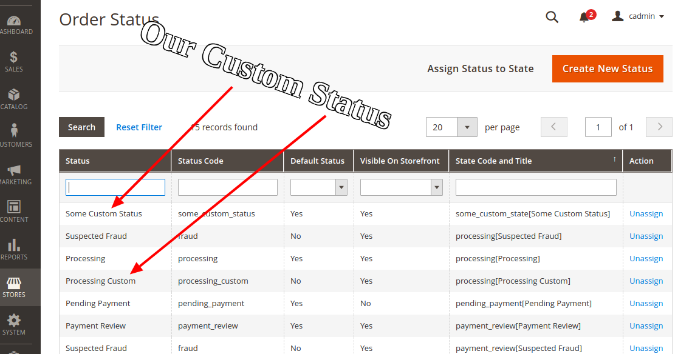

# Create new order state and status programmatically in Magento 2


## Goal:
- Add new order state and status  via setup script.


Run the Setup Upgrade command in order to activate the module and execute the setup script:

php bin/magento setup:upgrade
Now you can check the results in Stores -> Settings -> Order Status.

## Step By Step Tutorials

- [app/code/Bdcrops/OrderFlow/registration.php](registration.php)
```
<?php
    \Magento\Framework\Component\ComponentRegistrar::register(
        \Magento\Framework\Component\ComponentRegistrar::MODULE,
        'Bdcrops_OrderFlow', __DIR__
    );
```

- [app/code/Bdcrops/OrderFlow/etc/module.xml](etc/module.xml)
```
<?xml version="1.0"?>
<config xmlns:xsi="http://www.w3.org/2001/XMLSchema-instance" xsi:noNamespaceSchemaLocation="urn:magento:framework:Module/etc/module.xsd">
    <module name="Bdcrops_OrderFlow" setup_version="1.0.0"/>
    <sequence>
            <module name="Magento_Sales"/>
        </sequence>
</config>

```

- [app/code/Bdcrops/OrderFlow/Setup/InstallData.php](Setup/InstallData.php)

```
<?php

namespace Bdcrops\OrderFlow\Setup;

use Exception;
use Magento\Framework\Exception\AlreadyExistsException;
use Magento\Framework\Setup\InstallDataInterface;
use Magento\Framework\Setup\ModuleContextInterface;
use Magento\Framework\Setup\ModuleDataSetupInterface;
use Magento\Sales\Model\Order;
use Magento\Sales\Model\Order\Status;
use Magento\Sales\Model\Order\StatusFactory;
use Magento\Sales\Model\ResourceModel\Order\Status as StatusResource;
use Magento\Sales\Model\ResourceModel\Order\StatusFactory as StatusResourceFactory;
/**
 * Class InstallData
 */
class InstallData implements InstallDataInterface {
    /**
     * Custom Processing Order-Status code
     */
    const ORDER_STATUS_PROCESSING_FULFILLMENT_CODE = 'processing_custom';
    /**
     * Custom Processing Order-Status label
     */
    const ORDER_STATUS_PROCESSING_FULFILLMENT_LABEL = 'Processing Custom';

    /**
     * Custom Order-State code
     */
    const ORDER_STATE_CUSTOM_CODE = 'some_custom_state';
    /**
     * Custom Order-Status code
     */
    const ORDER_STATUS_CUSTOM_CODE = 'some_custom_status';
    /**
     * Custom Order-Status label
     */
    const ORDER_STATUS_CUSTOM_LABEL = 'Some Custom Status';
    /**
     * Status Factory
     *
     * @var StatusFactory
     */
    protected $statusFactory;
    /**
     * Status Resource Factory
     *
     * @var StatusResourceFactory
     */
    protected $statusResourceFactory;
    /**
     * InstallData constructor
     *
     * @param StatusFactory $statusFactory
     * @param StatusResourceFactory $statusResourceFactory
     */
    public function __construct(
        StatusFactory $statusFactory,
        StatusResourceFactory $statusResourceFactory
    ) {
        $this->statusFactory = $statusFactory;
        $this->statusResourceFactory = $statusResourceFactory;
    }
    /**
     * Installs data for a module
     *
     * @param ModuleDataSetupInterface $setup
     * @param ModuleContextInterface $context
     *
     * @return void
     *
     * @throws Exception
     */
    public function install(ModuleDataSetupInterface $setup, ModuleContextInterface $context)
    {
        $this->addNewOrderProcessingStatus();
        $this->addNewOrderStateAndStatus();
    }
    /**
     * Create new order processing status and assign it to the existent state
     *
     * @return void
     *
     * @throws Exception
     */
    protected function addNewOrderProcessingStatus() {
        /** @var StatusResource $statusResource */
        $statusResource = $this->statusResourceFactory->create();
        /** @var Status $status */
        $status = $this->statusFactory->create();
        $status->setData([
            'status' => self::ORDER_STATUS_PROCESSING_FULFILLMENT_CODE,
            'label' => self::ORDER_STATUS_PROCESSING_FULFILLMENT_LABEL,
        ]);

        try {
            $statusResource->save($status);
        } catch (AlreadyExistsException $exception) {

            return;
        }

        $status->assignState(Order::STATE_PROCESSING, false, true);
    }

    /**
     * Create new custom order status and assign it to the new custom order state
     *
     * @return void
     *
     * @throws Exception
     */
    protected function addNewOrderStateAndStatus(){
        /** @var StatusResource $statusResource */
        $statusResource = $this->statusResourceFactory->create();
        /** @var Status $status */
        $status = $this->statusFactory->create();
        $status->setData([
            'status' => self::ORDER_STATUS_CUSTOM_CODE,
            'label' => self::ORDER_STATUS_CUSTOM_LABEL,
        ]);
        try {
            $statusResource->save($status);
        } catch (AlreadyExistsException $exception) {

            return;
        }
        $status->assignState(self::ORDER_STATE_CUSTOM_CODE, true, true);
    }
}

```

## Ref:
- [](https://www.atwix.com/magento-2/create-new-order-state-and-status-programmatically-in-magento-2/)
