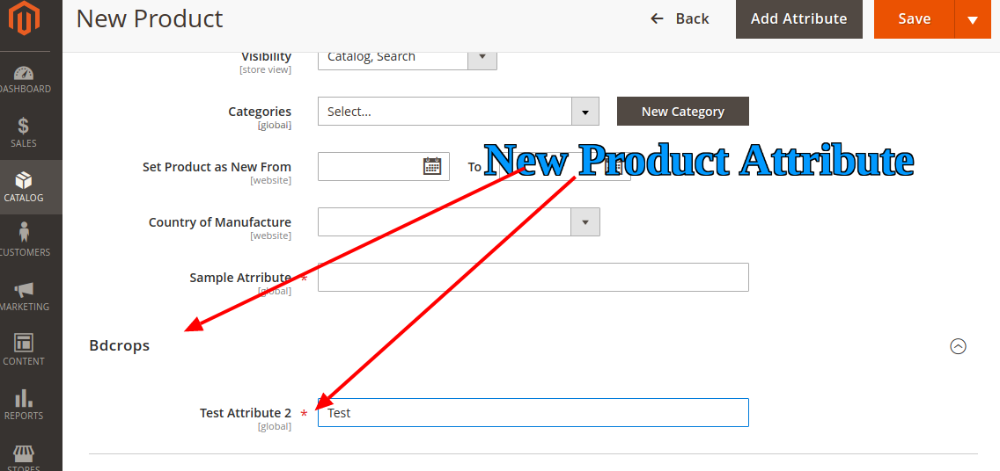

## How to create a custom product attribute programmatically in Magento 2 in a better way


## Goal

- add custom product attribute using setup db script



## Step By Step Tutorials

- [app/code/Bdcrops/ProductAttributes/registration.php](registration.php)
```
<?php
    \Magento\Framework\Component\ComponentRegistrar::register(
        \Magento\Framework\Component\ComponentRegistrar::MODULE,
        'Bdcrops_ProductAttributes',
        __DIR__
    );
```
- [app/code/Bdcrops/ProductAttributes/etc/module.xml](etc/module.xml)
```
<?xml version="1.0"?>
<config xmlns:xsi="http://www.w3.org/2001/XMLSchema-instance" xsi:noNamespaceSchemaLocation="urn:magento:framework:Module/etc/module.xsd">
    <module name="Bdcrops_ProductAttributes" setup_version="1.0.0"/>
</config>

```

- [app/code/Bdcrops/ProductAttributes/Setup/InstallData.php](InstallData.php)

```
<?php

namespace Bdcrops\ProductAttributes\Setup;

use Magento\Eav\Setup\EavSetup;
use Magento\Eav\Setup\EavSetupFactory;
use Magento\Framework\Setup\InstallDataInterface;
use Magento\Framework\Setup\ModuleContextInterface;
use Magento\Framework\Setup\ModuleDataSetupInterface;

class InstallData implements InstallDataInterface {
	private $eavSetupFactory;
	public function __construct(EavSetupFactory $eavSetupFactory) {
		$this->eavSetupFactory = $eavSetupFactory;
	}

	public function install(ModuleDataSetupInterface $setup, ModuleContextInterface $context)
	{
		$eavSetup = $this->eavSetupFactory->create(['setup' => $setup]);
		$eavSetup->addAttribute(
			\Magento\Catalog\Model\Product::ENTITY,
			'sample_attribute',[
				'type' => 'text',
				'backend' => '',
				'frontend' => '',
				'label' => 'Sample Atrribute',
				'input' => 'text',
				'class' => '',
				'source' => '',
				'global' => \Magento\Eav\Model\Entity\Attribute\ScopedAttributeInterface::SCOPE_GLOBAL,
				'visible' => true,
				'required' => true,
				'user_defined' => false,
				'default' => '',
				'searchable' => false,
				'filterable' => false,
				'comparable' => false,
				'visible_on_front' => false,
				'used_in_product_listing' => true,
				'unique' => false,
				'apply_to' => '' ]
		);
	}
}

```


## Ref:

https://www.mageplaza.com/magento-2-module-development/magento-2-add-product-attribute-programmatically.html
https://meigeeteam.com/blog/how-to-create-custom-product-attribute-in-magento-2/
