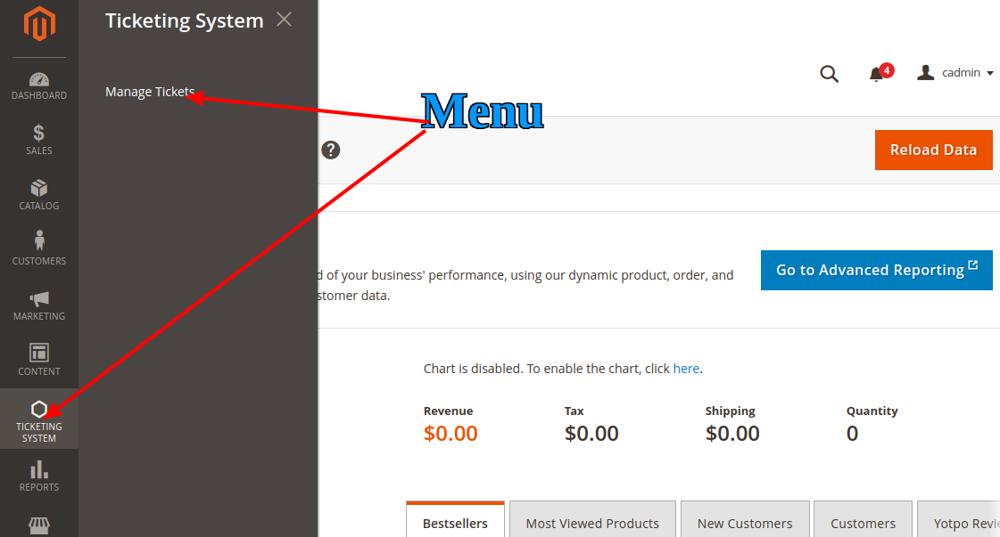
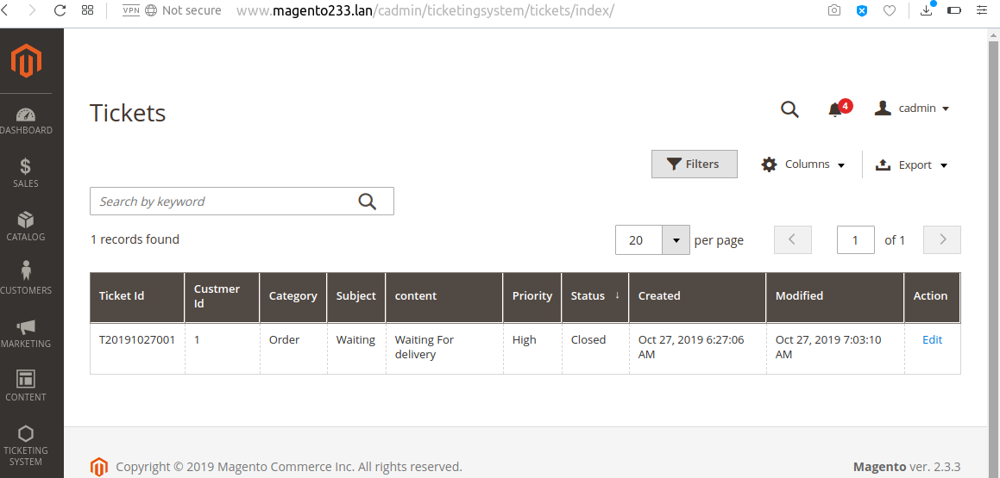
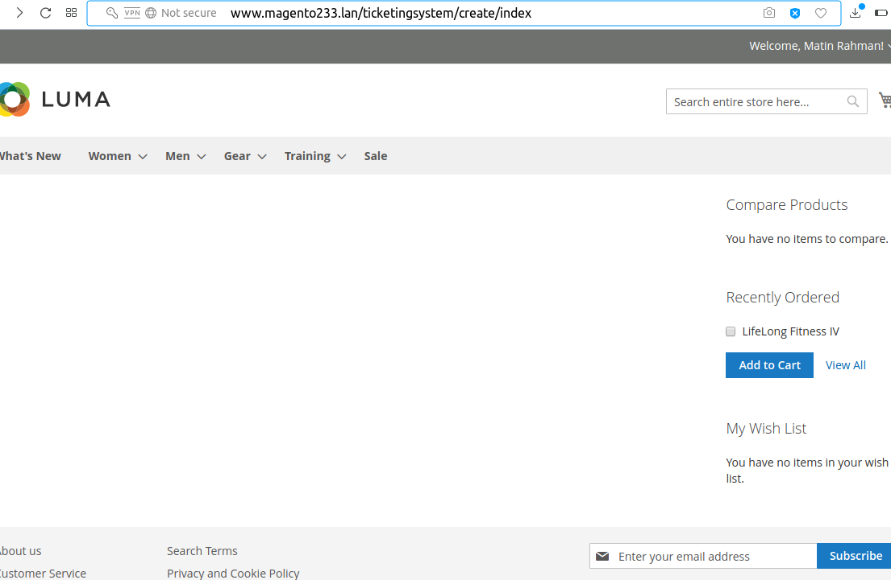
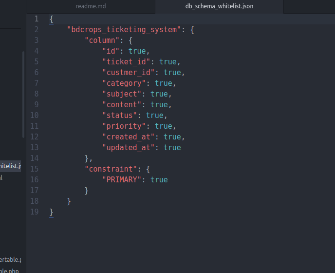
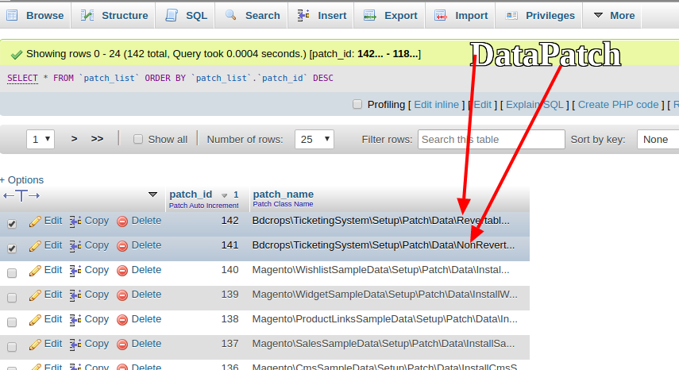

#  To Create Backend Admin Grid   In Magento 2

Magento 2 creation of admin grid is quite different from Magento 1. In this article we will see how we can create Magento 2 admin grid. Admin Grids. As you are aware Magento 2 Grids are kind of table which lists the items of your database table and provide you some common features like sort, filter, delete, update item, etc.
The below diagram show roughly the activities involved in creating admin grid. Further in the Article these all are described in detail.
For the purpose of this article we will create simple Ticketing system admin grid which shows the support tickets created by customers (The next article covers where logged in customer can raise a ticket, and also see his previous created tickets in List)






## Goal
- Create   Module
- Define Admin routes
- Create entries in menu.xml to Display your custom menus in Admin Panel
- Create Controller
- Define Database schema through Installer
- Create Model
- Use admin Grid Components to Create Grid UI.

## Create Module Step By Step Tutorials

- [/registration.php](registration.php)
- [/etc/module.xml](etc/module.xml)
- [/etc/adminhtml/routes.xml](etc/adminhtml/routes.xml)
- [/etc/adminhtml/menu.xml](etc/adminhtml/menu.xml)
- [/etc/frontend/routes.xml](etc/frontend/routes.xml)
- [/Controller/Adminhtml/Tickets/Index.php](Controller/Adminhtml/Tickets/Index.php)
- [/etc/db_schema.xml](etc/db_schema.xml)
- [/Setup/Patch/Data/NonRevertable.php](Setup/Patch/Data/NonRevertable.php)
- [/Setup/Patch/Data/Revertable.php](Setup/Patch/Data/Revertable.php)

  ```
  php bin/magento setup:db-declaration:generate-whitelist [options]
  php bin/magento setup:db-declaration:generate-whitelist --module-name=vendor_module

  php bin/magento setup:db-declaration:generate-whitelist --module-name=Bdcrops_TicketingSystem
  php bin/magento setup:upgrade --dry-run=1 --keep-generated
  php bin/magento setup:upgrade

  ```

  
  
  

- [Model/Tickets.php](Model/Tickets.php)
- [Model/ResourceModel/Tickets.php](Model/ResourceModel/Tickets.php)
- [Model/ResourceModel/Tickets/Collection.php](Model/ResourceModel/Tickets/Collection.php)
- [etc/di.xml](etc/di.xml)
- [Controller/Adminhtml/Tickets/Add.php](Controller/Adminhtml/Tickets/Add.php)
- [Controller/Adminhtml/Tickets/Index.php](Controller/Adminhtml/Tickets/Index.php)
- [Controller/Adminhtml/Tickets/Save.php](Controller/Adminhtml/Tickets/Save.php)
- [Controller/Create/Index.php](Controller/Create/Index.php)
- [Controller/Manage/Index.php](Controller/Manage/Index.php)
- [Model/ResourceModel/Tickets.php](Model/ResourceModel/Tickets.php)
- [Model/ResourceModel/Tickets/Collection.php](Model/ResourceModel/Tickets/Collection.php)
- [Model/Source/Category.php](Model/Source/Category.php)
- [Model/Source/Priority.php](Model/Source/Priority.php)
- [Model/Source/Status.php](Model/Source/Status.php)
- [Model/Tickets.php](Model/Tickets.php)
- [view/adminhtml/layout/ticketingsystem_tickets_index.xml](view/adminhtml/layout/ticketingsystem_tickets_index.xml)
- [view/adminhtml/ui_component/ticketingsystem_tickets_listing.xml](view/adminhtml/ui_component/ticketingsystem_tickets_listing.xml)
- [Block/Adminhtml/Module/Grid/Renderer/Action/UrlBuilder.php](Block/Adminhtml/Module/Grid/Renderer/Action/UrlBuilder.php)
- [Block/Adminhtml/Tickets/Add.php](Block/Adminhtml/Tickets/Add.php)
- [Block/Adminhtml/Tickets/Edit/Form.php](Block/Adminhtml/Tickets/Edit/Form.php)
- [Block/Create.php](Block/Create.php)
- [Block/Manage.php](Block/Manage.php)
- [Ui/Component/Listing/Column/Actions.php](Ui/Component/Listing/Column/Actions.php)
- [Ui/Component/Listing/Column/Update.php](Ui/Component/Listing/Column/Update.php)
- [view/adminhtml/layout/ticketingsystem_tickets_add.xml](view/adminhtml/layout/ticketingsystem_tickets_add.xml)
- [view/adminhtml/layout/ticketingsystem_tickets_index.xml](view/adminhtml/layout/ticketingsystem_tickets_index.xml)
- [view/adminhtml/ui_component/ticketingsystem_tickets_listing.xml](view/adminhtml/ui_component/ticketingsystem_tickets_listing.xml)


## Ref
 - [magentodeveloper](https://magentodeveloper.in/magento-2-admin-grid.html)
 - [KtreeOpenSource](https://github.com/KtreeOpenSource/Magento2Examples)
